# AgriStress — Master System Architecture

**AI-Driven Crop-Type Classification, Phenology-Aware Moisture-Stress Detection, and 8-Day Irrigation Advisory for Canal Command Areas**

> ISRO **Bharatiya Antariksh Hackathon (BAH) 2026 — Problem Statement 6**
> Multi-sensor optical + microwave fusion across **40+ satellites** that **cross-verify and gap-fill** each other, served on an **O(1) read-hot-path** platform.

| | |
|---|---|
| **Document** | Master Architecture (centerpiece). This is the authoritative system blueprint. |
| **Status** | `v1.0` — living document |
| **Companion deep-dives** | [`SATELLITE_CATALOG.md`](./SATELLITE_CATALOG.md) · [`DATA_FUSION.md`](./DATA_FUSION.md) · [`PLATFORM_O1.md`](./PLATFORM_O1.md) · [`MODELS.md`](./MODELS.md) · [`IRRIGATION_ADVISORY.md`](./IRRIGATION_ADVISORY.md) |
| **Scope** | End-to-end: ingestion → ARD datacube → 3 analytic heads → advisory engine → dashboard/API. |
| **Targets** | Crop OA **> 85 %** (+ Kappa), growth-stage-aware stress, command-area-credible advisory. |
| **National relevance** | PMKSY, PMFBY, Digital Agriculture Mission (DAM), NMSA. |

---

## Table of Contents

1. [Executive Summary & Design Principles](#1-executive-summary--design-principles)
2. [Problem Framing, Objectives & Success Metrics](#2-problem-framing-objectives--success-metrics)
3. [System Overview](#3-system-overview)
4. [Data Layer — the 40+ Satellite Fleet & Gap-Filling Matrix](#4-data-layer--the-40-satellite-fleet--gap-filling-matrix)
5. [Data-Fusion Pipeline (6 Stages)](#5-data-fusion-pipeline-6-stages)
6. [O(1) Platform & Compute](#6-o1-platform--compute)
7. [AI/ML Models — Triple-Track](#7-aiml-models--triple-track)
8. [Irrigation-Advisory Engine](#8-irrigation-advisory-engine)
9. [Dashboard & APIs](#9-dashboard--apis)
10. [Validation & Evaluation Strategy](#10-validation--evaluation-strategy)
11. [Deployment & Scaling](#11-deployment--scaling)
12. [Security, Privacy & Data Governance](#12-security-privacy--data-governance)
13. [30-Hour Hackathon Execution Plan](#13-30-hour-hackathon-execution-plan)
14. [Pilot AOIs](#14-pilot-aois)
15. [Repository Map](#15-repository-map)
16. [Risks & Mitigations](#16-risks--mitigations)
17. [References](#17-references)

---

## 1. Executive Summary & Design Principles

**AgriStress** is an operational, nationally-scalable geospatial-AI system that converts the raw output of a worldwide fleet of **40+ Earth-observation satellites** into three decision-grade products for Indian canal command areas:

1. **Crop-type maps** — multi-temporal optical+SAR classification, target **Overall Accuracy (OA) > 85 %** with Cohen's **Kappa** and per-class F1 / User's & Producer's accuracy.
2. **Phenology-aware moisture-stress maps** — stage-wise stress (emergence → development → mid-season → maturity), gated by Growing-Degree-Day (GDD) phenology so a "low NDVI" at senescence is *not* mislabelled as stress.
3. **8-day crop-water-deficit & irrigation-advisory maps** — a FAO-56 root-zone water balance producing a 5-class advisory, aggregated pixel → field → outlet/distributary for warabandi (rotational-turn) water management.

A live **dashboard** (MapLibre GL + FastAPI) ties the three together with a time slider, per-field popups, command-area roll-ups and time-series charts.

The novelty is twofold and deliberate, mapping directly to the user mandate:

- **Multi-sensor redundancy as a first-class architectural property.** No single sensor is on a critical path. Optical clouds during the kharif monsoon are filled by SAR and geostationary sensors; coarse passive soil moisture is sharpened by active SAR; thermal gaps are filled across ECOSTRESS/Landsat-TIRS/MODIS. Every sensor in the fleet is positioned to **cross-verify** (independent confirmation, triple-collocation) and **gap-fill** (substitute when a primary is absent) at least one other. The full mapping is the [Gap-Filling Matrix](#46-the-gap-filling-matrix).
- **O(1) read-hot-path.** All heavy Earth-observation computation is pushed **offline** into a "factory" (Google Earth Engine + batch jobs) that precomputes a gap-free analysis-ready datacube and writes it into cloud-native formats (COG, Zarr, PMTiles, GeoParquet) indexed by an **H3** discrete global grid. Every interactive user action — pan a tile, click a pixel, query an advisory — resolves to a **constant-time** read (CDN tile, Redis `GET`, or a single H3-keyed range read), independent of dataset size. See the [latency budget](#65-per-user-action-latency-budget).

### 1.1 Design principles

| # | Principle | What it means in AgriStress | Where realised |
|---|---|---|---|
| **P1** | **Multi-sensor redundancy** | 40+ satellites; Tier-1 core of 12; every gap has ≥2 fallback sensors; triple-collocation merges. | §4, §5 |
| **P2** | **O(1) read-hot-path** | Precompute offline; serve via CDN/Redis/H3 constant-time reads. Never run EO compute synchronously in a request. | §6 |
| **P3** | **Phenology-aware** | Stress and Kc are interpreted *relative to crop growth stage*, not absolute index thresholds. | §5.5, §7C, §8 |
| **P4** | **Uncertainty-quantified** | Every pixel of every product carries a σ / confidence band (fusion weights, classifier probability, water-balance error). | §5.6, §7, §10 |
| **P5** | **Scalable pilot → national** | Same code path runs one command area or all of India; only the AOI registry and compute budget change. | §11 |
| **P6** | **Cloud-native & open** | COG/STAC/Zarr/PMTiles/GeoParquet; Apache-2.0; reproducible configs; GEE + Cloud Run + Redis + CDN. | §6, §11 |
| **P7** | **Physically grounded + ML** | FAO-56 / Penman–Monteith water balance constrains and cross-checks ML; ML never overrides mass balance silently. | §7, §8 |
| **P8** | **Good-practice validation** | Olofsson 2014 stratified, area-proportion accuracy with area-adjusted confidence intervals; spatial block CV (no leakage). | §10 |

### 1.2 One-paragraph "how it works"

For a season, the factory ingests every available scene from the 40+ fleet, harmonizes optical surface reflectance (HLS-style), speckle-filters and terrain-corrects SAR, spatiotemporally fuses them into an **8-day, 10–30 m, cloud-free, uncertainty-tagged ARD datacube**, and derives phenology (SOS/peak/EOS/LGP). Three analytic heads read this cube: a gradient-boosted classifier on the multi-temporal feature stack (plus an AlphaEarth-embedding track) produces the crop map; a phenology-gated anomaly model produces stage-wise stress; and a FAO-56 engine produces the 8-day deficit and advisory. All products are written to COG + H3 + PMTiles + a Feast/Redis feature store, then served at O(1) to the dashboard and API.

---

## 2. Problem Framing, Objectives & Success Metrics

### 2.1 The problem (PS6, restated precisely)

> *Develop an AI/ML methodology that (a) classifies crop types for the **current** season from **multi-temporal** spectral signatures of the **previous** season's analog, (b) detects moisture-stress dynamics **across growth stages** using optical and/or microwave indicators, and (c) estimates **8-day crop-water-deficit** and produces **irrigation-advisory maps for canal command areas**, with a dashboard. Optical (LISS-III/AWiFS/Sentinel-2/Landsat/MODIS) + SAR (EOS-04/Sentinel-1/NISAR), ancillary rainfall/ET/soil/command-layers, ground truth for train/validate.*

### 2.2 Objectives → deliverables

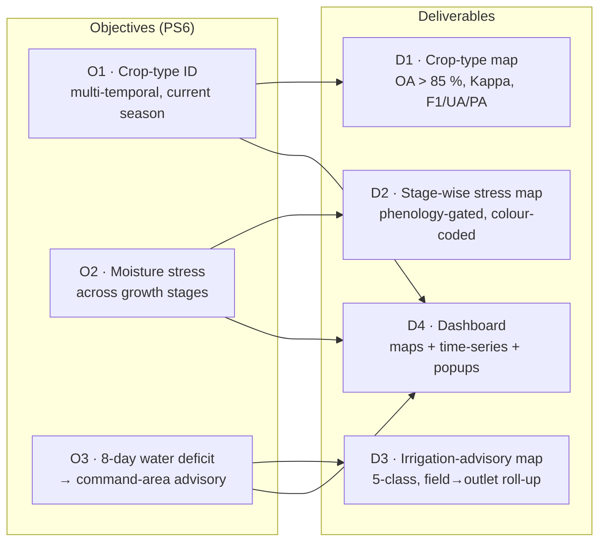

### 2.3 Success metrics

| Deliverable | Primary metric | Target | Secondary / supporting |
|---|---|---|---|
| **D1 Crop-type** | Overall Accuracy | **> 85 %** | Cohen's Kappa ≥ 0.80; per-class F1, User's (UA) & Producer's (PA) accuracy; **area-adjusted** estimates + 95 % CI (Olofsson) |
| **D2 Stress** | Growth-stage-aware correspondence | Logical, monotone w/ indices | Agreement of stress class vs SMAP/EOS-04 SM anomaly; vs VHI/TVDI/CWSI; vs rainfall-deficit periods |
| **D3 Advisory** | Command-area credibility | Consistent w/ water balance & reference | ETc vs OpenET/SSEBop ETa (RMSE, bias); deficit vs IMD rainfall anomaly; outlet-level demand plausibility |
| **D4 Dashboard** | Interactive latency | O(1) (see §6.5) | Tiles 50–100 ms; Redis < 5 ms; cube read < 50 ms |
| **System** | Reproducibility | 100 % config-driven | Deterministic seeds; pinned asset IDs; CI typecheck/lint |

**Why these metrics matter to ISRO.** OA + Kappa are the PS6-mandated classification metrics. Area-adjusted accuracy (Olofsson good practice) makes the crop-area statistics *defensible for policy* (PMFBY claims, DAM crop sown-area). Stage-aware stress avoids the classic false alarm of flagging senescing crops as drought-stressed. Command-area credibility means the advisory could plug into a real PMKSY canal schedule.

---

## 3. System Overview

AgriStress follows a **medallion** data architecture (Bronze → Silver → Gold) with a strict separation between an **offline factory** (heavy, lazy, batched) and an **online serving plane** (constant-time reads). The three analytic heads (crop / stress / irrigation) all hang off a single **Gold ARD datacube**, guaranteeing they see *identical, co-registered, uncertainty-tagged* inputs.

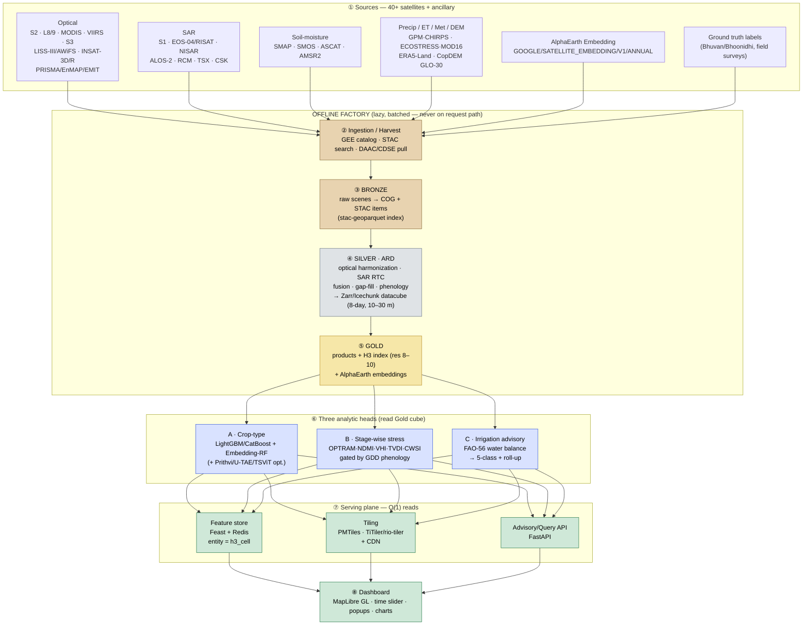

**Reading the diagram.** Data flows strictly left-to-right / top-to-bottom through the factory; the *only* arrows that cross into the serving plane are pre-materialized products. The dashboard never reaches back into the factory. This is what makes the read path O(1).

| Layer | Format(s) | Index | Latency class | Owner doc |
|---|---|---|---|---|
| Bronze | COG, STAC items, stac-geoparquet | scene id / MGRS | batch | [`PLATFORM_O1.md`](./PLATFORM_O1.md) |
| Silver (ARD) | Zarr / Icechunk chunked cube | (x,y,t,band) chunks | batch | [`DATA_FUSION.md`](./DATA_FUSION.md) |
| Gold | COG products + GeoParquet + H3 | `(h3_cell, date, variable)` | precompute | [`PLATFORM_O1.md`](./PLATFORM_O1.md) |
| Feature store | Redis (online) / Parquet (offline) | `entity = h3_cell` | **< 5 ms** | [`PLATFORM_O1.md`](./PLATFORM_O1.md) |
| Tiles | PMTiles / TiTiler COG | XYZ / quadkey | **50–100 ms** | [`PLATFORM_O1.md`](./PLATFORM_O1.md) |
| API | FastAPI JSON | h3 / field id | **< 50 ms** | §9 |

---

## 4. Data Layer — the 40+ Satellite Fleet & Gap-Filling Matrix

> Full per-sensor table (bands, resolutions, revisit, asset IDs, access portals) lives in [`SATELLITE_CATALOG.md`](./SATELLITE_CATALOG.md). This section gives the **tiered fleet** and the **gap-filling logic**.

The fleet is organized so that **capability**, not any single satellite, is guaranteed. We group by *function* (what physical signal each provides) and by *operational tier* (how central it is to the day-1 pipeline).

### 4.1 Fleet by function (40+ platforms)

| Function | Satellites / sensors | Why in the fleet |
|---|---|---|
| **Optical — high-res multispectral** | Sentinel-2 A/B/**C**, Landsat 8/9 (+5/7 archive), Resourcesat-2/2A **LISS-III / AWiFS / LISS-IV**, GaoFen-1/6 | Vegetation vigour, red-edge, biochemistry; the crop-classification backbone |
| **Optical — coarse, high-revisit** | MODIS (Terra/Aqua), VIIRS (SNPP/JPSS), Sentinel-3 OLCI/SLSTR | Daily NDVI/EVI, BRDF/NBAR, phenology smoothing, cloud gap context |
| **Optical — geostationary** | INSAT-3D/3DR/3DS, Himawari-8/9 AHI, GOES-R ABI | Sub-hourly looks → see between clouds in monsoon; diurnal thermal |
| **Hyperspectral** | PRISMA, EnMAP, EMIT (ISS), (Tanager/CHIME-class) | Resolve spectrally-confusable crops; narrow-band stress pigments |
| **SAR — C-band** | Sentinel-1 A/**C**, RADARSAT-2 / **RCM**, EOS-04 (RISAT-1A) C-band, SAOCOM (L) cross-check | All-weather backscatter; structure & surface moisture |
| **SAR — L-band** | **NISAR (L+S, launched 30 Jul 2025)**, ALOS-2 PALSAR-2, SAOCOM-1A/B | Deeper canopy/soil penetration; robust monsoon mapping |
| **SAR — X-band / commercial** | TerraSAR-X / TanDEM-X, COSMO-SkyMed, ICEYE, Capella | High-res tasking, field-scale structure, surge capacity |
| **Dedicated soil moisture (passive)** | **SMAP** L-band, SMOS, AMSR2 | Root-zone-relevant SM; the SM truth anchor |
| **Soil moisture (active/scatterometer)** | ASCAT (Metop), S1-derived surface SM, NISAR-derived | High-revisit SM; downscaling partner for SMAP |
| **Precipitation** | **GPM IMERG V07**, **CHIRPS v2/v3**, TRMM (archive), INSAT-derived rainfall | Water-balance input; gauge-sparse fill |
| **Thermal / ET** | **ECOSTRESS** (ISS), Landsat TIRS, MODIS **MOD11/MOD16**, VIIRS LST | LST, CWSI/TVDI, actual-ET cross-check |
| **DEM / terrain** | **Copernicus GLO-30**, SRTM, NASADEM, ALOS AW3D30 | SAR terrain correction, slope/aspect, flow routing |
| **Ancillary / reanalysis / derived** | **ERA5-Land / AgERA5**, ESA WorldCover, **Dynamic World**, **AlphaEarth Satellite Embedding V1** | ET0 drivers, land-cover priors, foundation-model features |

> **Real asset IDs** (representative, GEE): `COPERNICUS/S2_SR_HARMONIZED`, `COPERNICUS/S1_GRD`, `LANDSAT/LC09/C02/T1_L2`, `NASA/HLS/HLSL30/v002` & `HLSS30`, `MODIS/061/MOD13Q1`, `MODIS/061/MOD11A2`, `MODIS/061/MOD16A2GF`, `NASA/VIIRS/002/VNP13A1`, `NASA/SMAP/SPL4SMGP/008`, `NASA/GPM_L3/IMERG_V07`, `UCSB-CHC/CHIRPS/DAILY` (and `UCSB-CHC/CHIRPS/V3/DAILY_SAT`), `NASA/ECOSTRESS/...`, `COPERNICUS/DEM/GLO30`, `ECMWF/ERA5_LAND/HOURLY`, `ESA/WorldCover/v200`, `GOOGLE/DYNAMICWORLD/V1`, `GOOGLE/SATELLITE_EMBEDDING/V1/ANNUAL`.

### 4.2 Tier-1 — Operational Core (12)

These are GEE-native (or near-real-time accessible), and the **day-1 demo runs on these alone**.

| # | Sensor | Role on hot path | GEE asset (representative) |
|---|---|---|---|
| 1 | **Sentinel-2 A/B/C** | Optical backbone; NDVI/EVI/NDWI/NDMI/red-edge | `COPERNICUS/S2_SR_HARMONIZED` |
| 2 | **Sentinel-1 A/C** | SAR all-weather; VV/VH/ratio/RVI | `COPERNICUS/S1_GRD` |
| 3 | **Landsat 8/9** | 30 m optical + **TIRS thermal**; HLS partner | `LANDSAT/LC0{8,9}/C02/T1_L2` |
| 4 | **MODIS** | Daily NDVI/EVI, NBAR c-factor, LST, ET | `MODIS/061/MOD13Q1`, `…/MOD11A2`, `…/MOD16A2GF` |
| 5 | **VIIRS** | MODIS continuity; daily VI/LST | `NASA/VIIRS/002/VNP13A1` |
| 6 | **SMAP** | Root-zone soil-moisture anchor | `NASA/SMAP/SPL4SMGP/008` |
| 7 | **GPM IMERG V07** | Precipitation (water balance) | `NASA/GPM_L3/IMERG_V07` |
| 8 | **CHIRPS** | Precip blend, gauge-sparse fill | `UCSB-CHC/CHIRPS/DAILY` |
| 9 | **ECOSTRESS** | High-res LST / ET / CWSI | `NASA/ECOSTRESS/L2T_LSTE` (+ ET) |
| 10 | **NISAR** (L+S) | Deep-penetration SAR, SM downscale (post-commissioning) | (NASA/ISRO; ingest via DAAC) |
| 11 | **EOS-04 / RISAT** | Indigenous C-band SAR | (Bhoonidhi/NRSC) |
| 12 | **Copernicus GLO-30 DEM** | Terrain correction, routing | `COPERNICUS/DEM/GLO30` |

### 4.3 Tier-2 — Robustness (~20)

Sentinel-3, INSAT-3D/3DR, Himawari, GOES, Resourcesat LISS-III/AWiFS/LISS-IV, GaoFen, PRISMA, EnMAP, EMIT, SMOS, ASCAT, AMSR2, ALOS-2 PALSAR-2, RADARSAT/RCM, SAOCOM, TRMM (archive), Landsat 5/7 (archive), NASADEM, SRTM, AW3D30, ERA5-Land/AgERA5, ESA WorldCover, Dynamic World, AlphaEarth embeddings. → Cross-verification, downscaling partners, and substitutes during Tier-1 outages.

### 4.4 Tier-3 — Commercial surge

TerraSAR-X/TanDEM-X, COSMO-SkyMed, ICEYE, Capella, Planet (PlanetScope/SkySat). → On-demand tasking for very-high-res field disputes, validation, or persistent-cloud emergencies. Optional (keys in `.env`); never required.

### 4.5 Cross-verification design

Redundancy is exploited *quantitatively*, not just as backup:

- **Triple-collocation (TC)** estimates each sensor's error variance from three mutually-independent sources (e.g., SMAP × ASCAT × model SM, or S1-NDVIproxy × S2-NDVI × MODIS-NDVI) **without ground truth**, then combines them with **inverse-error-variance weights** → an optimally merged, error-quantified product.
- **Optical↔SAR consistency:** SAR-predicted NDVI (learned SAR→NDVI) is checked against optical NDVI on clear days; large residuals flag clouds/snow/sensor faults.
- **Independent-physics agreement:** crop-water-deficit from the FAO-56 balance is cross-checked against **OpenET/SSEBop** ETa (energy-balance) and against rainfall anomalies. Divergence raises an uncertainty flag rather than a silent product.

### 4.6 The Gap-Filling Matrix

Each row is a *failure mode*; columns are the *primary capability*, the *gap-fill strategy*, and the *fallback sensors* that make the capability resilient.

| Gap / failure mode | Primary | Gap-fill strategy | Fallback sensors / method |
|---|---|---|---|
| **Monsoon cloud cover** (kharif) blocks optical | S2 / Landsat | SAR is cloud-immune; geostationary sees between clouds; spatiotemporal fusion reconstructs NDVI | **S1 + NISAR + EOS-04**; INSAT-3D/Himawari/GOES; SAR→NDVI regression (RF/cGAN); ESTARFM/FSDAF |
| **Coarse soil moisture** (SMAP 9 km too coarse for fields) | SMAP L4 (9 km) | Active-SAR disaggregation to field scale | **SMAP+S1 (SPL2SMAP_S / DISPATCH)**, NISAR-derived SM; TC merge SMAP/ASCAT/AMSR2 |
| **Low optical revisit** (5-day S2, 16-day Landsat) | S2 A/B/C | Add coarse high-revisit + fuse to 8-day/30 m | **MODIS/VIIRS daily**; HISTARFM/ESTARFM; Planet (commercial) |
| **Missing thermal / LST** for CWSI/ET | Landsat TIRS / ECOSTRESS | Multi-source thermal stack + sharpening | **ECOSTRESS + MOD11 + VIIRS LST**; thermal sharpening (DisTrad/TsHARP) |
| **Terrain distortion** in SAR; flow routing | — | Radiometric-terrain-correction & hydrological conditioning from best DEM | **CopDEM GLO-30**, NASADEM, SRTM, AW3D30 |
| **Crop spectral confusion** (rice/wheat/sugarcane overlap) | S2 multispectral | Add red-edge, polarimetry, hyperspectral, phenology | **S2 red-edge B5–B7**; S1/NISAR **polarimetry (RVI, VV/VH)**; **PRISMA/EnMAP/EMIT**; phenometrics |
| **Rain-gauge sparsity** | IMD gauges | Satellite precipitation merge | **GPM IMERG V07 + CHIRPS**; INSAT-derived; bias-correct to gauges |
| **Sensor / constellation outage** (e.g., S1B loss precedent) | any single sensor | Redundant constellations + TC reweighting | Swap S1→NISAR/EOS-04; S2→Landsat/HLS; SMAP→ASCAT/AMSR2 |
| **Atmospheric / aerosol contamination** | S2 SR | Cloud/shadow masking + reflectance harmonization | **Fmask + s2cloudless + Cloud Score+**; LaSRC/Sen2Cor; HLS bandpass |

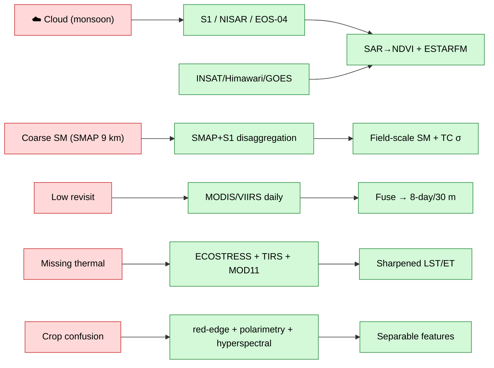

---

## 5. Data-Fusion Pipeline (6 Stages)

> Algorithms, equations and parameterizations in full: [`DATA_FUSION.md`](./DATA_FUSION.md). **Output contract:** an *8-day, 10–30 m, gap-free, uncertainty-tagged* ARD datacube `(x, y, t, band, σ)`.

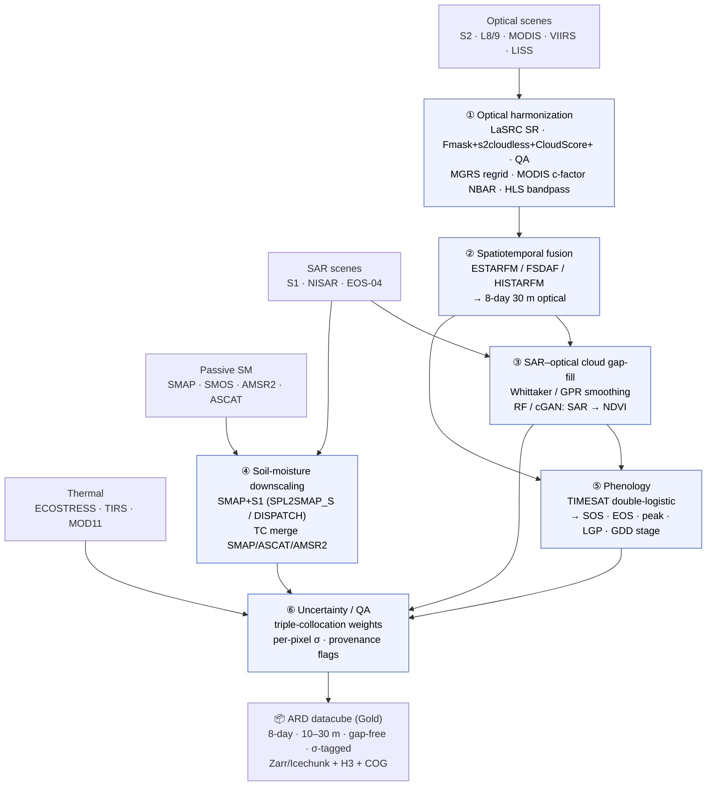

### Stage 1 — Optical harmonization

- **Surface reflectance**: LaSRC (Landsat) / Sen2Cor or LaSRC-style for S2; ingest via `S2_SR_HARMONIZED`.
- **Cloud & shadow masking**: union of **Fmask**, **s2cloudless**, and Google **Cloud Score+** (`cs_cdf`) plus QA60/SCL; conservative dilation for cirrus/shadows.
- **Grid**: reproject/regrid to common **MGRS** tiles; nearest/bilinear per band semantics.
- **BRDF/NBAR**: MODIS **c-factor** nadir-BRDF adjustment for view-angle consistency across S2/Landsat.
- **Cross-sensor harmonization**: **HLS bandpass adjustment** so Landsat-8/9 OLI and S2 MSI are interoperable (Claverie et al. 2018). Result: a harmonized optical surface-reflectance stack.

### Stage 2 — Spatiotemporal fusion

Blend the *frequent-but-coarse* (MODIS/VIIRS) with the *fine-but-infrequent* (S2/Landsat) to synthesize **8-day, 30 m** optical where no clear fine scene exists. Methods: **ESTARFM** (enhanced spatial-temporal adaptive reflectance fusion) / **FSDAF** (flexible spatiotemporal data fusion) for heterogeneous fields; **HISTARFM** (Bayesian histogram-matched) for gap-free monthly/8-day baselines. STARFM prediction kernel (weighted neighbours $w_i$ by spectral, spatial, temporal distance):

$$F(x_w,t_p)=\sum_{i=1}^{n} w_i\,\big[\,C(x_i,t_p)+\big(F(x_i,t_0)-C(x_i,t_0)\big)\big]$$

### Stage 3 — SAR–optical cloud gap-fill

For pixels still cloudy after Stage 2: (a) **temporal smoothing** of the optical VI series via the **Whittaker** smoother or **Gaussian-Process Regression (GPR)** with per-point QA weights; (b) **SAR→NDVI translation** — a Random Forest / conditional-GAN learns $\text{NDVI} = f(\text{VV}, \text{VH}, \text{VH/VV}, \text{RVI}, \text{incidence})$ from co-located clear days, then predicts NDVI under cloud from SAR. This is the monsoon workhorse.

### Stage 4 — Soil-moisture downscaling & merge

- **Active disaggregation**: combine SMAP brightness/SM (9 km) with S1 backscatter to produce field-scale SM via **SPL2SMAP_S**-style or **DISPATCH** (optical-thermal triangle) approaches; NISAR L-band extends this post-commissioning.
- **Multi-sensor merge**: **triple-collocation** weights across SMAP / ASCAT / AMSR2 → a merged SM with per-pixel error. Feeds the water balance (init/validate) and the stress head.

### Stage 5 — Phenology extraction

Fit **double-logistic** curves (TIMESAT-style) to the gap-free 8-day VI series per pixel/field to extract **SOS, EOS, peak, LGP**, and amplitude. Accumulated **Growing-Degree-Days** ($\text{GDD}=\sum \max(\tfrac{T_{max}+T_{min}}{2}-T_{base},0)$) map calendar time → **growth stage** (emergence/development/mid-season/late). These stages *gate* both stress interpretation (§7C) and crop coefficient $K_{cb}$ (§8).

$$g(t)=v_{min}+(v_{max}-v_{min})\left[\frac{1}{1+e^{-m_1(t-s_1)}}+\frac{1}{1+e^{m_2(t-s_2)}}-1\right]$$

### Stage 6 — Uncertainty / QA

Every output band gets a co-registered **σ layer** and **provenance flags** (which sensors contributed, gap-fill method, cloud fraction). TC-derived weights propagate into product uncertainty; downstream heads consume σ (e.g., classifier sample weights, advisory confidence). This is what makes AgriStress **uncertainty-quantified** end-to-end (P4).

---

## 6. O(1) Platform & Compute

> Concrete formats, chunking, H3 keying, Feast/Redis schema, tiling config: [`PLATFORM_O1.md`](./PLATFORM_O1.md).

### 6.1 Medallion architecture

**Bronze** (raw COG + STAC) → **Silver** (ARD Zarr cube) → **Gold** (products + H3 + embeddings). Each layer is immutable and reproducible from configs; promotion is a batch job, never a request.

### 6.2 GEE as offline "factory" (not a live backend)

Earth Engine is used for its planetary catalog and lazy, **server-side** computation (tile-pyramid pushdown), but it is **never** placed on the synchronous user path. We respect its operational envelope — roughly **~40 concurrent requests / ~100 rps / 5000-element** payload limits — by **precomputing** products in batch (`Export.image.toCloudStorage` to COG, `getPixels`/`computePixels` for arrays) and serving the *results*, not live EE queries.

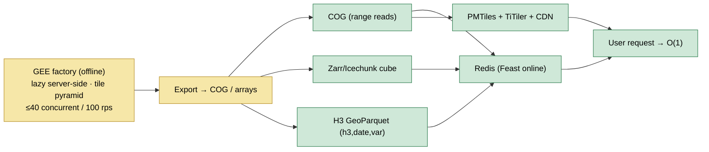

### 6.3 Cloud-native formats (constant-time reads by construction)

| Format | Why | Access pattern |
|---|---|---|
| **COG** (Cloud-Optimized GeoTIFF) | Internal tiling + overviews | HTTP **range reads** — fetch only the tile/zoom you need |
| **Zarr / Icechunk** | Chunked N-D datacube `(x,y,t,band)` | Read one chunk = O(chunk), independent of cube size; Icechunk adds transactions/versioning |
| **PMTiles** | Single-file tile archive | One range read per tile; CDN-friendly, serverless |
| **GeoParquet / stac-geoparquet** | Columnar vector + STAC catalog | Predicate/column pushdown; fast metadata scans |

### 6.4 H3 spatial index + Feast/Redis feature store + AlphaEarth embeddings

- **H3** discrete global grid (Uber) at **resolution 8–10** (~edge 460 m → 65 m) gives every location a single hierarchical hex id. Products are keyed `(h3_cell, date, variable)` so a point/field query is a **single hash lookup → O(1)**, with cheap parent/child roll-ups for command-area aggregation.
- **Feast + Redis** feature store: `entity = h3_cell`; the online store holds the latest feature vector (indices, SAR, phenometrics, SM, advisory class). `get_online_features()` → Redis `GET` in **< 5 ms**.
- **AlphaEarth Satellite Embeddings** (`GOOGLE/SATELLITE_EMBEDDING/V1/ANNUAL`): **64-D unit vectors** per 10 m pixel summarizing a full year (optical+SAR+thermal+DEM+climate, phenology-aware). Because they are L2-normalized, similarity is a **dot product (cosine)**; crop/irrigation classification becomes an **embedding lookup + a light classifier** (RF/linear head) → **near-O(1) inference**, no per-request deep-net forward pass.

### 6.5 Per-user-action latency budget

| User action | Mechanism | Target latency | Class |
|---|---|---|---|
| Pan/zoom a map layer | CDN-cached PMTiles / COG tile | **50–100 ms** | O(1) |
| Click a pixel/field → current features | Redis `GET` (Feast online) | **< 5 ms** | O(1) |
| Read a value from the H3 datacube | H3-keyed range read (COG/Parquet) | **< 50 ms** | O(1) |
| Command-area roll-up / OLAP aggregate | Pre-aggregated H3 parents / DuckDB on Parquet | **< 500 ms** | ~O(1)* |
| **Cold / un-processed AOI** | **Async job** (factory) → notify when ready | seconds–minutes | batch |

\* Roll-ups over a fixed command area touch a bounded set of pre-aggregated parent cells → effectively constant for a given AOI.

**Net effect:** for any AOI already in the Gold layer, *every* interactive action is constant-time and independent of national dataset size. Only first-touch of a brand-new AOI is asynchronous — and even that is just a factory run, after which it too is O(1).

---

## 7. AI/ML Models — Triple-Track

> Architectures, hyper-parameters, feature lists, training/inference code: [`MODELS.md`](./MODELS.md).

We run **three complementary tracks** and ensemble them; uncertainty is carried throughout. Tracks A/C are **CPU-friendly and demo-ready**; Track B (and optional transformers) add accuracy where GPU is available.

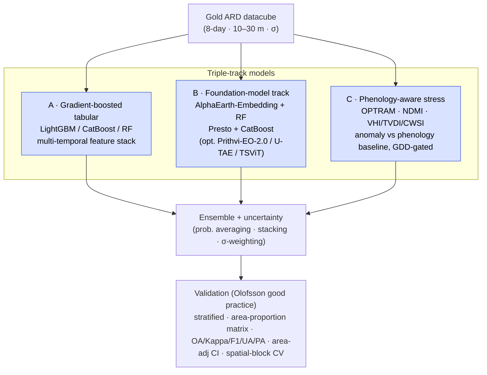

### Track A — Gradient-boosted tabular (the OA>85% workhorse)

Per pixel/field, a **multi-temporal feature stack**:

- **Optical indices** (8-day series): NDVI, EVI, **NDWI**, **NDMI** (+ red-edge NDRE, GCVI).
- **SAR**: S1 **VV, VH, VH/VV ratio, RVI** $=\tfrac{4\sigma^0_{VH}}{\sigma^0_{VV}+\sigma^0_{VH}}$ (+ NISAR/EOS-04 when present).
- **Texture**: **GLCM** (contrast, homogeneity, entropy) on SAR/optical.
- **Phenometrics**: SOS, EOS, peak, LGP, amplitude, integral (from Stage 5).

Classifiers: **LightGBM / CatBoost / Random Forest**. Expected **88–93 % OA** with representative training/validation samples. Fast to train (minutes), trivially deployable, and the σ layer is used as **sample weights** so noisy/cloudy pixels count less.

### Track B — Foundation-model / deep track

- **AlphaEarth-Embedding + RF/linear** — 64-D annual embeddings → light classifier; near-O(1) inference, strong with *few* labels (label-efficient). Benchmarks show foundation-embedding + simple head is highly competitive for agricultural mapping.
- **Presto + CatBoost** — lightweight pretrained pixel-timeseries transformer (Presto) embeddings → boosted head; excellent when labels are scarce.
- **Optional GPU**: **Prithvi-EO-2.0** (IBM/NASA geospatial FM, fine-tune), **U-TAE** (temporal-attention U-Net for SITS), **TSViT** (time-series ViT) for end-to-end spatial-temporal classification when data volume & GPU permit.

### Track C — Phenology-aware stage-wise stress

Stress is **not** an absolute threshold; it is an **anomaly relative to the crop's own phenological baseline**, gated by GDD growth stage:

- **Water/moisture indices**: **OPTRAM** soil-moisture index $W=\tfrac{i_d-i}{i_d-i_w}$ (from the STR–NDVI trapezoid), **NDMI**, **NDWI**.
- **Stress/condition**: **VHI** (= $\alpha\,\text{VCI}+(1-\alpha)\,\text{TCI}$), **TVDI** (temperature–vegetation dryness), **CWSI** (crop-water-stress index from canopy–air ΔT).
- **Phenology gating**: a low NDVI during **senescence** is *expected* (not stress); the same drop during **mid-season** with high CWSI and low SM **is** stress. Each pixel's index is compared to its stage-conditioned historical/spatial baseline; output is a **stage-labelled, colour-coded stress class** with confidence.

### Ensemble & uncertainty

Crop: probability-averaging / stacking of A+B with per-class confidence; disagreement → flagged for review. Stress: agreement across OPTRAM/VHI/TVDI/CWSI + SM raises confidence; physical cross-checks (SM, rainfall) gate alarms. All products carry a confidence band into the dashboard.

### Validation (preview; full in §10)

**Olofsson et al. (2014) good practice**: stratified sampling, **area-proportion** (estimator-weighted) confusion matrix, **OA / Kappa / F1 / UA / PA**, **area-adjusted accuracy with 95 % CI**, and **spatial block cross-validation** to prevent train/test spatial leakage (a common cause of over-optimistic remote-sensing accuracies).

---

## 8. Irrigation-Advisory Engine

> Full equations, soil/crop parameter tables, warabandi scheduling, validation: [`IRRIGATION_ADVISORY.md`](./IRRIGATION_ADVISORY.md).

A **physically-grounded FAO-56** root-zone water balance, cross-checked by satellite energy-balance ET, producing an 8-day deficit and a 5-class advisory aggregated to canal infrastructure.

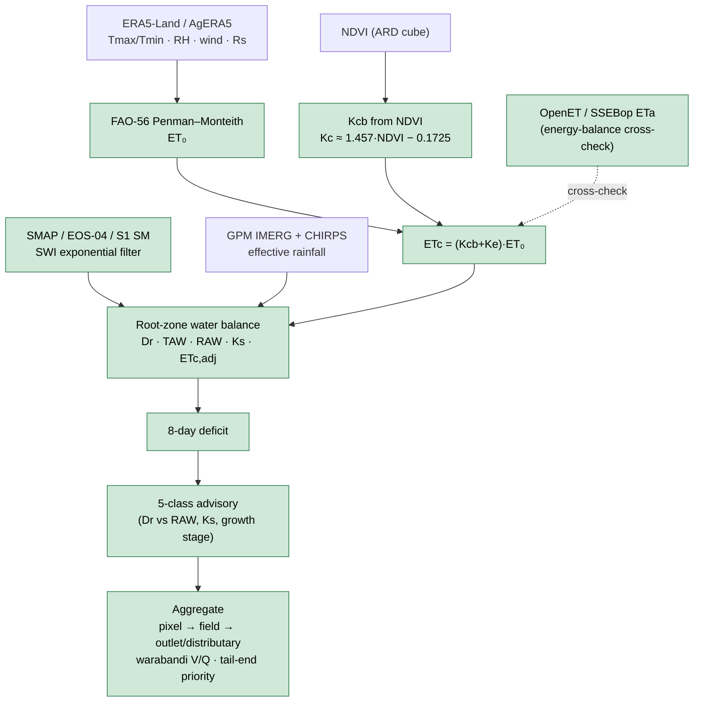

### 8.1 Reference ET and crop ET

- **ET0** via **FAO-56 Penman–Monteith** (the canonical hourly/daily reference). Drivers from ERA5-Land/AgERA5.
- **Basal crop coefficient from NDVI**: $K_{cb}\approx 1.457\cdot\text{NDVI}-0.1725$ (empirical, region-tunable), so $K_{cb}$ tracks the *actual observed* canopy rather than a fixed calendar curve.
- **Crop ET**: $\text{ET}_c=(K_{cb}+K_e)\,\text{ET}_0$, with $K_e$ the soil-evaporation coefficient.
- **Cross-check**: **SSEBop / OpenET** actual ET (ETa) from satellite energy balance validates ETc and flags divergence.

### 8.2 Root-zone water balance (FAO-56 dual-Kc)

$$\text{TAW}=1000\,(\theta_{FC}-\theta_{WP})\,Z_r \qquad \text{RAW}=p\cdot\text{TAW}$$

$$K_s=\frac{\text{TAW}-D_r}{(1-p)\,\text{TAW}}\quad(0\le K_s\le 1)\qquad \text{ET}_{c,\text{adj}}=K_s\,(K_{cb}+K_e)\,\text{ET}_0$$

Daily depletion update (water balance of the root zone):

$$D_{r,i}=D_{r,i-1}-(P_i-RO_i)-I_i-CR_i+\text{ET}_{c,\text{adj},i}+DP_i$$

where $P$=precip, $RO$=runoff, $I$=irrigation, $CR$=capillary rise, $DP$=deep percolation. **Soil moisture** (SMAP/EOS-04/S1, smoothed via the **Soil Water Index** exponential filter $\text{SWI}_t=\text{SWI}_{t-1}+K_t(\text{SM}_t-\text{SWI}_{t-1})$) **initializes and validates** $D_r$.

### 8.3 5-class advisory (tied to $D_r$ vs RAW, $K_s$, growth stage)

| Class | Condition | Colour | Meaning |
|---|---|---|---|
| **0 · No-irrigation** | $D_r \le 0.5\,\text{RAW}$, $K_s=1$ | 🟦 Blue | Soil water ample |
| **1 · Watch** | $0.5\,\text{RAW} < D_r \le \text{RAW}$ | 🟩 Green | Monitor; no action yet |
| **2 · Irrigate-soon** | $\text{RAW} < D_r \le \text{RAW}+0.5(\text{TAW}-\text{RAW})$ | 🟨 Yellow | Approaching stress; schedule turn |
| **3 · Irrigate-now** | $D_r > \text{RAW}$, $K_s<1$ | 🟧 Orange | Stress onset; irrigate this cycle |
| **4 · Critical** | $D_r \to \text{TAW}$, $K_s\ll1$, sensitive stage | 🟥 Red | Severe deficit at sensitive stage; priority |

Class is **modulated by growth stage** (the depletion fraction $p$ and sensitivity differ by stage; flowering/grain-fill are weighted critical).

### 8.4 Net/gross depth and command-area aggregation

- **Net irrigation depth** $d_{net}=D_r$ (refill to field capacity); **gross** $d_{gross}=d_{net}/E_a$ ($E_a$=application efficiency).
- **Aggregation**: pixel → field (parcel) → **outlet/distributary** → command, using H3 parent roll-ups. **Warabandi** turn-time $t=V/Q$ (volume required $V=d_{gross}\times A$, canal discharge $Q$); **tail-end priority** logic ensures equitable distribution. Outputs plug into command-area scheduling — the "credible for command-area planning" bar in PS6.

---

## 9. Dashboard & APIs

### 9.1 Dashboard (MapLibre GL)

A single-page web app rendering three core layers over a basemap, with a **time slider** (8-day steps across the season):

- **Crop-type layer** — categorical palette (e.g., rice = teal, wheat = gold, sugarcane = magenta, cotton = orange, fallow = grey, other = muted), legend + class areas.
- **Stage-wise stress layer** — sequential/diverging ramp (no-stress green → moderate amber → severe red), with the **growth stage** shown in the popup.
- **Advisory layer** — the 5-class palette from §8.3 (blue→green→yellow→orange→red).
- **Interactions**: field/pixel **popups** (crop, stage, stress, SM, $D_r$, advisory, confidence); **command-area roll-ups** (areas by class, total water demand); **time-series charts** (NDVI/SAR/SM/ETc/deficit per field).

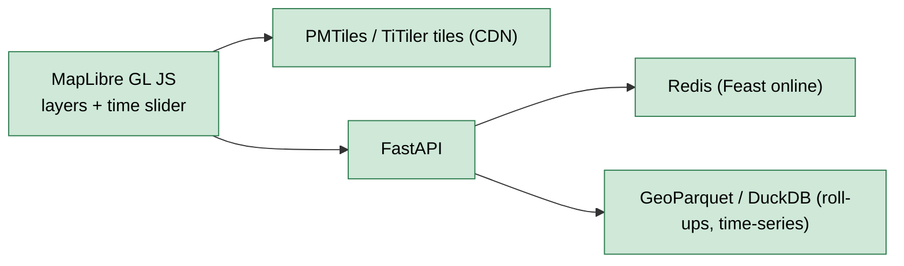

### 9.2 FastAPI endpoints

| Endpoint | Method | Input | Output | Backed by |
|---|---|---|---|---|
| `/crop` | GET | `lat,lon` or `h3` or `field_id` | crop class + probability | Redis / H3 cube |
| `/stress` | GET | `h3`/`field_id`, `date` | stress class + growth stage + indices | Redis / H3 cube |
| `/advisory` | GET | `h3`/`field_id`, `date` | 5-class advisory, $D_r$, $d_{net}/d_{gross}$, $K_s$ | Advisory store |
| `/tiles/{layer}/{z}/{x}/{y}` | GET | XYZ | PNG/MVT tile | PMTiles / TiTiler + CDN |
| `/timeseries` | GET | `field_id`, `var`, range | series array | H3 cube / Parquet |
| `/command/{id}/rollup` | GET | command id, `date` | class areas + water demand | H3 parents / DuckDB |

All read endpoints resolve to O(1)/near-O(1) stores (§6.5). Heavy AOI processing is a separate async job endpoint that returns a job id.

---

## 10. Validation & Evaluation Strategy

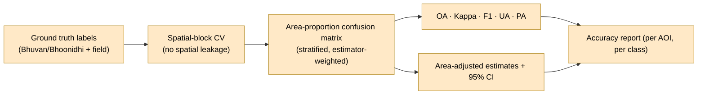

| Product | Method | Reference truth | Acceptance |
|---|---|---|---|
| **Crop-type** | Olofsson stratified, area-proportion CM; spatial-block CV | Field GT / Bhuvan | **OA>85 %**, Kappa≥0.80, area-adj CI reported |
| **Stress** | Correspondence & anomaly agreement | SMAP/EOS-04 SM anomaly; VHI/TVDI; rainfall-deficit windows | Logical, stage-aware, monotone |
| **ET / deficit** | Cross-validation vs energy-balance ETa | OpenET/SSEBop; flux towers if available | ETc–ETa RMSE/bias within tolerance |
| **Advisory** | Plausibility vs command schedule & rainfall | IMD rainfall anomaly; command demand | Consistent with reference; tail-end logic holds |
| **Uncertainty** | Calibration | TC error variances; reliability diagrams | σ well-calibrated |

**Why Olofsson, why spatial CV.** Random pixel splits leak spatial autocorrelation and inflate accuracy; **spatial block CV** gives an honest generalization estimate. **Area-adjusted** accuracy + CIs turn map accuracy into *defensible area statistics* — exactly what PMFBY/DAM need.

---

## 11. Deployment & Scaling

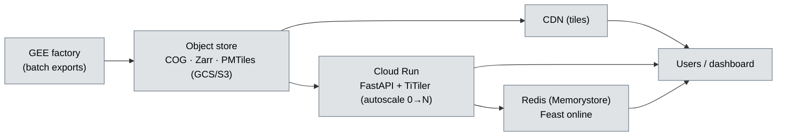

| Stage | Compute | Storage | Notes |
|---|---|---|---|
| **Pilot (hackathon)** | GEE + 1 Cloud Run svc + local/managed Redis | One bucket | Single command area; Tier-1 sensors |
| **Multi-command** | Scheduled GEE batch (Cloud Scheduler) + Cloud Run autoscale | Partitioned by AOI/season | Same code; AOI registry grows |
| **National** | Parallel GEE high-volume + worker pool; CDN fronts all tiles | Tiled COG/Zarr by tile×date | Cost scales with **area×revisit**, not user count (reads are O(1)) |

**Cost notes.** GEE compute is free for research/non-commercial within quota; egress and Cloud Run/Redis dominate at scale. Because the read path is precomputed and CDN-cached, **serving cost is decoupled from user traffic** — the expensive part is the periodic factory run, which is bounded by `area × bands × revisit` and is embarrassingly parallel across tiles.

---

## 12. Security, Privacy & Data Governance

- **Credentials**: all provider keys (`EE_PROJECT`, `EARTHDATA_*`, `COPERNICUS_*`, `BHUVAN_*`, `BHOONIDHI_*`, AWS) live in `.env` / secret manager — **never committed** (`.env` is gitignored; see `.env.example`). Service accounts for headless GEE.
- **Data licensing & sovereignty**: respect ESA/Copernicus, NASA/USGS open licences and **ISRO/NRSC (Bhuvan/Bhoonidhi)** terms; indigenous (LISS/AWiFS/EOS-04/NISAR-S) products processed per NRSC policy. Indian datacubes can be hosted in **`ap-south-1`** for data-residency.
- **Privacy**: outputs are field/parcel-level geospatial layers; no personal data. If parcel ownership is ever joined (e.g., for advisory delivery), apply access control and anonymization; advisories are aggregated to command/outlet for public dashboards.
- **Provenance & reproducibility**: STAC lineage, per-pixel sensor-provenance flags (§5.6), pinned asset IDs and config hashes; deterministic seeds. Auditable for PMFBY-grade use.
- **Integrity**: read-only public API; write/processing endpoints authenticated; rate-limited; CORS-scoped.

---

## 13. 30-Hour Hackathon Execution Plan

**Strategy:** deliver a *working* vertical slice on **Tier-1, GEE-native sensors only** first (S2, S1, L8/9, MODIS, SMAP, GPM, CHIRPS, ECOSTRESS, CopDEM), then deepen. Always keep a demoable build.

```mermaid
gantt
  title AgriStress — 30h execution (hours shown via durations; section titles give the windows)
  dateFormat X
  axisFormat %Hh
  section Foundation 0-6h
  Repo/config/AOI registry         :a1, 0, 2h
  GEE ingest S2+S1+L8/9 (Tier-1)   :a2, after a1, 4h
  section ARD + features 6-14h
  Cloud mask + harmonize + indices :b1, after a2, 3h
  SAR VV/VH/RVI + GLCM             :b2, after b1, 2h
  Phenology (TIMESAT) + GDD        :b3, after b2, 3h
  section Models 14-22h
  Track A LightGBM crop (OA>85%)   :c1, after b3, 4h
  Track C phenology-aware stress   :c2, after c1, 2h
  Track B AlphaEarth-embed + RF    :c3, after c2, 2h
  section Advisory + UI 22-30h
  FAO-56 ET0/ETc + water balance   :d1, after c3, 3h
  5-class advisory + roll-up       :d2, after d1, 1h
  Dashboard + API + tiles          :d3, after d2, 3h
  Validation + polish + demo       :d4, after d3, 1h
```

**Day-1 demo path (fastest to "it works"):** S2+S1 over one command area → cloud-masked NDVI/EVI/NDWI + VV/VH/RVI stack → LightGBM crop map (OA>85%) → NDVI-anomaly stress (phenology-gated) → FAO-56 ETc + simple deficit → MapLibre dashboard with the three layers + time slider. Everything beyond (NISAR, hyperspectral, transformers, full TC merge) is *additive*, never blocking.

---

## 14. Pilot AOIs

| AOI | Region | System / crops | Why chosen |
|---|---|---|---|
| **Mula–Nira command** *(default: `mula_nira_command`)* | Maharashtra (Deccan) | Multi-crop: sugarcane, cotton, horticulture, rabi grains | Default AOI in config; classic canal command; multi-crop stresses classifier & advisory |
| **Bhakra command** | Punjab/Haryana | Rice–wheat double-crop | Intensive, well-documented; rice (flooded → SAR-favourable) + wheat; strong GT availability |
| **Tungabhadra command** | Karnataka/AP (Krishna basin) | Paddy, sugarcane, cotton | Large inter-state command; tail-end equity & warabandi showcase |

These span the three dominant Indian irrigated regimes (Deccan multi-crop, Indo-Gangetic rice-wheat, Peninsular paddy), demonstrating national generality. Configs in `configs/aois/`.

---

## 15. Repository Map

```
bah2026-ps6/
├── docs/
│   ├── ARCHITECTURE.md          ← (this file — master blueprint)
│   ├── SATELLITE_CATALOG.md     ← full 40+ sensor table, asset IDs, access
│   ├── DATA_FUSION.md           ← 6-stage fusion algorithms & equations
│   ├── PLATFORM_O1.md           ← medallion, COG/Zarr/PMTiles, H3, Feast/Redis
│   ├── MODELS.md                ← triple-track ML, training/inference, validation
│   └── IRRIGATION_ADVISORY.md   ← FAO-56 engine, soil/crop params, warabandi
├── src/agristress/
│   ├── config/                  ← pydantic-settings (Settings), AOI registry
│   ├── ingest/                  ← GEE/STAC/DAAC/CDSE harvest → Bronze (COG/STAC)
│   ├── fusion/                  ← optical harmonize, SAR RTC, ESTARFM/FSDAF, SM downscale, phenology, σ
│   ├── datacube/                ← Zarr/Icechunk + H3 indexing + Gold products
│   ├── features/                ← index/SAR/GLCM/phenometric feature builders + Feast defs
│   ├── models/                  ← Track A/B/C (LightGBM, embedding-RF, Presto, stress), ensemble
│   ├── advisory/                ← FAO-56 ET0/Kcb/water-balance, 5-class, roll-up
│   ├── serving/                 ← FastAPI app, TiTiler, Redis client
│   └── pipeline/                ← CLI (`agristress …`), DAG orchestration
├── gee/                         ← Earth Engine scripts/exports (factory jobs)
├── dashboard/                   ← MapLibre GL SPA (layers, time slider, charts)
├── configs/                     ← default.yaml, aois/*, sensors/*, models/*
├── pyproject.toml · environment.yml · requirements*.txt · .env.example
```

Entry point: `agristress = "agristress.pipeline.cli:app"` (Typer). Core deps already pinned (earthengine-api, rioxarray/xarray/zarr/dask, geopandas, **h3**, pystac-client, stackstac/odc-stac); extras: `ml` (sklearn/xgboost/lightgbm/torch/timm), `serving` (fastapi/uvicorn/rio-tiler/titiler/redis), `viz`.

---

## 16. Risks & Mitigations

| # | Risk | Likelihood | Impact | Mitigation |
|---|---|---|---|---|
| R1 | Persistent monsoon cloud → no optical | High | High | SAR (S1/NISAR/EOS-04) + geostationary + SAR→NDVI gap-fill (§4.6, §5.3) |
| R2 | Sparse / biased ground truth → OA shortfall | Med | High | Foundation-embedding label-efficiency (Track B); Olofsson area-adjusted CIs; active-learning sample plan |
| R3 | NISAR still in commissioning during pilot | Med | Low | Architecture treats NISAR as additive; Tier-1 runs without it; ingest when L2 products release |
| R4 | GEE quota / rate limits hit | Med | Med | Factory pattern: batch precompute, never serve live; high-volume endpoint; back-off & tiling |
| R5 | Spatial autocorrelation inflates accuracy | Med | Med | Spatial-block CV; report area-adjusted accuracy, not naive pixel OA |
| R6 | Indigenous data access latency (Bhuvan/Bhoonidhi) | Med | Med | Pre-stage EOS-04/LISS scenes; degrade gracefully to S1/S2; cache |
| R7 | Advisory mis-calibration → wrong irrigation call | Low | High | Dual cross-check (OpenET ETa + rainfall + SM); confidence bands; growth-stage weighting; human-in-loop for Class 4 |
| R8 | Cost blow-up at national scale | Low | Med | Precompute + CDN decouples serving cost from traffic; tile-parallel factory; `ap-south-1` egress control |
| R9 | Sensor outage (e.g., S1 unit loss) | Low | Med | Redundant constellations + TC reweighting (§4.5) |

---

## 17. References

**Optical harmonization & cloud masking**
- Claverie et al. (2018), *The Harmonized Landsat and Sentinel-2 (HLS) surface reflectance dataset* — https://doi.org/10.1016/j.rse.2018.09.002 · HLS: https://hls.gsfc.nasa.gov/
- Cloud Score+ (S2 cloud/shadow) — https://developers.google.com/earth-engine/datasets/catalog/GOOGLE_CLOUD_SCORE_PLUS_V1_S2_HARMONIZED

**Spatiotemporal fusion**
- Gao et al. (2006), *STARFM* — https://doi.org/10.1109/TGRS.2006.872081
- Zhu et al. (2010), *ESTARFM* — https://doi.org/10.1016/j.rse.2010.05.032 · Zhu et al. (2016), *FSDAF* — https://doi.org/10.1016/j.rse.2015.11.016

**Soil moisture**
- SMAP L4 (`NASA/SMAP/SPL4SMGP/008`) — https://developers.google.com/earth-engine/datasets/catalog/NASA_SMAP_SPL4SMGP_008
- SMAP/Sentinel-1 active-passive disaggregation (**SPL2SMAP_S**) — https://nsidc.org/data/spl2smap_s

**Precipitation**
- GPM IMERG V07 (`NASA/GPM_L3/IMERG_V07`) — https://developers.google.com/earth-engine/datasets/catalog/NASA_GPM_L3_IMERG_V07
- CHIRPS — https://www.chc.ucsb.edu/data/chirps

**Phenology**
- Jönsson & Eklundh (2004), **TIMESAT** — https://doi.org/10.1016/j.cageo.2004.05.006 · https://web.nateko.lu.se/timesat/

**ET & irrigation**
- Allen et al. (1998), **FAO-56** Crop Evapotranspiration — https://www.fao.org/4/x0490e/x0490e00.htm
- **OpenET** — https://openetdata.org/ · SSEBop (Senay et al. 2013) — https://doi.org/10.1111/jawr.12057

**Validation**
- Olofsson et al. (2014), *Good practices for assessing accuracy and estimating area of land change* — https://doi.org/10.1016/j.rse.2014.02.015

**Foundation models / ML**
- **Prithvi-EO-2.0** (IBM/NASA) — https://huggingface.co/ibm-nasa-geospatial
- **Presto** (Tseng et al. 2023) — https://arxiv.org/abs/2304.14065
- **AlphaEarth Foundations / Satellite Embedding V1** — https://deepmind.google/blog/alphaearth-foundations-helps-map-our-planet-in-unprecedented-detail/ · dataset: https://developers.google.com/earth-engine/datasets/catalog/GOOGLE_SATELLITE_EMBEDDING_V1_ANNUAL

**Platform / formats**
- **H3** discrete global grid — https://h3geo.org/
- **COG** — https://www.cogeo.org/ · **PMTiles** — https://docs.protomaps.com/pmtiles/ · **STAC** — https://stacspec.org/ · **Zarr** — https://zarr.dev/ · **Icechunk** — https://icechunk.io/

**Missions**
- **NISAR** (launched 30 Jul 2025, L+S band, 12-day repeat) — https://www.isro.gov.in/Mission_GSLVF16_NISAR_Home.html · https://www.eoportal.org/satellite-missions/nisar

---

> *AgriStress turns a redundant, self-verifying fleet of 40+ satellites into an O(1)-served, phenology-aware, uncertainty-quantified decision system for Indian irrigated agriculture — pilot today, national tomorrow.*
