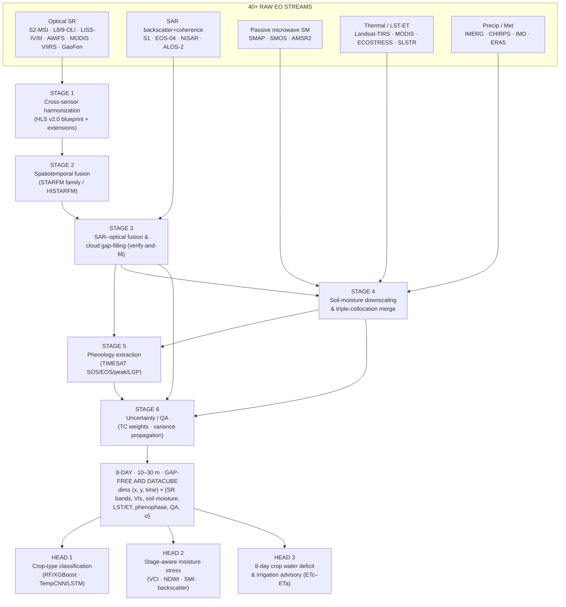
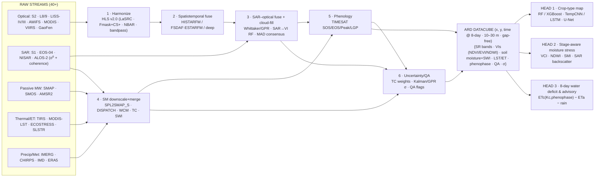

# AgriStress — Multi-Sensor Data-Fusion & Gap-Filling Methodology

**Project:** AgriStress (ISRO BAH 2026, Problem Statement 6 — AI-Driven Crop-Type, Moisture-Stress Detection & Irrigation Advisory across Growth Stages)
**Document scope:** The end-to-end methodology that turns **40+ heterogeneous Earth-observation streams** (optical, SAR, soil-moisture radiometers, thermal, precipitation) into **one 8-day, 10–30 m, gap-free, uncertainty-tagged Analysis-Ready Datacube (ARD)** where every sensor *cross-verifies* and *gap-fills* the others.
**Design philosophy:** *verify-and-fill.* No single sensor is trusted in isolation. Optical vigour is cross-checked by SAR structure; passive soil moisture is sharpened by active SAR and optical/thermal evaporative efficiency; every cloud gap is reconstructed from a physically-independent observation and tagged with a propagated per-pixel uncertainty σ.

---

## 0. Why fuse 40+ streams? The core thesis

A crop pixel is observed by instruments that respond to **different physics**:

| Physical domain | What it senses | Representative sensors |
|---|---|---|
| Reflective optical (VIS–SWIR) | Chlorophyll, leaf water, canopy structure | Sentinel-2 MSI, Landsat 8/9 OLI, LISS-IV/III, AWiFS, MODIS, VIIRS, GaoFen, ResourceSat |
| Active microwave (SAR) | Canopy geometry, biomass, surface roughness, dielectric (moisture) | Sentinel-1 C-SAR, EOS-04 (RISAT) C-SAR, NISAR L/S, ALOS-2 PALSAR-2 L-SAR |
| Passive microwave (radiometer) | Surface soil moisture via emissivity (L/C/X-band) | SMAP L-band, SMOS L-band, AMSR2 C/X, FY-3 |
| Thermal IR | Land-surface temperature, evapotranspiration, water stress | Landsat TIRS, MODIS LST, VIIRS, ECOSTRESS, Sentinel-3 SLSTR |
| Precipitation / met | Rainfall forcing, reference ET | IMERG/GPM, CHIRPS, IMD gridded, ERA5, GLDAS |

Because the error sources of these domains are **largely uncorrelated** (cloud contamination hits optical but not SAR; speckle hits SAR but not radiometers; RFI hits L-band passive but not optical), combining them yields three independent gains that a single sensor can never provide:

1. **Outlier detection (cross-verification).** Two physically-independent estimates of the same geophysical quantity (e.g. greenness from MSI-NDVI vs. SAR-reconstructed NDVI) disagree only when one is wrong. Median/MAD consensus rejects the bad one.
2. **Gap-filling (redundancy in space-time).** When optical is blind under monsoon cloud, all-weather SAR and passive microwave still observe — the *fill* is a measurement, not an interpolation.
3. **Variance reduction + quantified uncertainty.** Merging *N* unbiased estimates with inverse-error-variance weights drives the merged error variance below any individual sensor's, and the merge **emits** a per-pixel σ that propagates into every downstream decision (stress class, irrigation advisory).

This document operationalizes that thesis as **six fusion stages** feeding a single datacube and three analytic heads (crop type, stage-aware stress, 8-day water deficit / irrigation advisory).

---

## 1. Pipeline at a glance

---

## STAGE 1 — Cross-sensor harmonization

**Goal:** force every optical sensor onto a single radiometric + geometric reference so that a reflectance value means the same thing regardless of which satellite produced it. Without this, downstream fusion fuses *biases*, not signal.

The reference blueprint is **NASA's Harmonized Landsat-Sentinel-2 (HLS v2.0)** product (Claverie et al., 2018). HLS makes Landsat 8/9 OLI and Sentinel-2 MSI **interoperable** (≈2–3 day combined revisit at 30 m) through a fixed processing chain, which we adopt and then **extend** to MODIS/VIIRS and the Indian/Chinese fleet.

### 1.1 The HLS v2.0 processing chain (adopted verbatim)

| Step | Operation | Tooling / standard |
|---|---|---|
| 1 | Atmospheric correction → surface reflectance | **LaSRC** (Land Surface Reflectance Code) applied to both OLI and MSI TOA; common aerosol/water-vapour/ozone handling |
| 2 | Cloud / cloud-shadow / snow masking | **Fmask 4.x** (object-based cloud+shadow) **+ Cloud Score+** `cs_cdf` (see §1.2) |
| 3 | Common grid | Resample/reproject to **MGRS / UTM tiles at 30 m** (nearest for masks, bilinear/cubic for SR), pixel-aligned to Landsat ARD grid |
| 4 | BRDF normalization → nadir reflectance | **MODIS-BRDF c-factor NBAR** with **Ross-Thick / Li-Sparse-Reciprocal** kernels (see §1.3) |
| 5 | Cross-sensor radiometric match | **OLI ↔ MSI bandpass adjustment** (see §1.4) |
| 6 | Output | HLS **S30** (Sentinel-2 → 30 m) and **L30** (Landsat → 30 m), band-harmonized, NBAR, masked |

### 1.2 Cloud / shadow masking — Fmask 4.7 + Cloud Score+

- **Fmask 4.7** provides object-based cloud, cloud-shadow, snow and water labels from the thermal+optical bands (Landsat) and optical-only (Sentinel-2). It is the HLS default mask.
- **Cloud Score+** (Pasquarella et al., 2023, CVPR — *weakly-supervised video learning*) augments Fmask, especially for Sentinel-2 which lacks a thermal band. It outputs two quality bands:
  - `cs` — instantaneous spectral quality (sensitive to haze, thin cloud edges).
  - `cs_cdf` — a cumulative-distribution-based score that is **robust to terrain shadow and small spectral perturbations**, the recommended band for masking.
- **Operational threshold:** keep pixel iff `cs_cdf ≥ τ`, with **τ ≈ 0.5–0.6** as the AgriStress default (a deliberately permissive value that maximizes clear-pixel retention under monsoon conditions; published applications use 0.60–0.65, up to 0.80 for strict composites). Pixels with `cs_cdf < τ` are flagged `CLOUD/SHADOW` and routed to Stage 3 for reconstruction rather than discarded.

> **Rule:** masking never *deletes* data — it *labels* it. A masked optical pixel becomes a gap-fill *request* to Stage 2/3, and the chosen fill source is recorded in the QA layer.

### 1.3 BRDF normalization — MODIS c-factor NBAR (Ross-Li kernels)

Reflectance depends on sun-sensor geometry (view zenith θ_v, solar zenith θ_s, relative azimuth φ). To make S2 and Landsat (different overpass geometry) comparable, each band is normalized to **Nadir BRDF-Adjusted Reflectance (NBAR)** via the **c-factor** approach:

$$\rho_{\text{NBAR}}(\lambda) = \rho_{\text{obs}}(\lambda,\theta_s,\theta_v,\phi)\cdot c(\lambda), \qquad
c(\lambda)=\frac{R(\theta_s,\,\theta_v{=}0,\,\phi;\ \boldsymbol{f}(\lambda))}{R(\theta_s,\theta_v,\phi;\ \boldsymbol{f}(\lambda))}$$

where the BRDF model is the linear kernel sum used by MODIS MCD43:

$$R(\theta_s,\theta_v,\phi)=f_{\text{iso}} + f_{\text{vol}}\,K_{\text{vol}}^{\text{Ross-Thick}}(\theta_s,\theta_v,\phi) + f_{\text{geo}}\,K_{\text{geo}}^{\text{Li-Sparse-R}}(\theta_s,\theta_v,\phi)$$

HLS uses **fixed, globally-representative BRDF coefficients** `(f_iso, f_vol, f_geo)` per band (Roy et al., 2016/2017) so the c-factor is cheap and stable. `K_vol` is the **Ross-Thick** volumetric-scattering kernel; `K_geo` is the **Li-Sparse-Reciprocal** geometric-optical kernel.

### 1.4 OLI ↔ MSI bandpass adjustment

Sentinel-2 MSI and Landsat OLI have slightly different **spectral response functions**; even after LaSRC+NBAR a residual band-dependent offset remains. HLS applies a per-band linear transform to bring **Sentinel-2A (S2A) reflectance into the OLI reference**:

$$\rho_{\text{OLI}}(\lambda) = a(\lambda)\,\rho_{\text{S2A}}(\lambda) + b(\lambda)$$

**S2A → OLI coefficients (HLS v2.0):**

| Band | Slope a | Intercept b |
|---|---|---|
| Blue  | 0.9778 | −0.0040 |
| Green | 1.0053 | −0.0009 |
| Red   | 0.9765 | +0.0009 |
| NIR   | 0.9983 | −0.0001 |
| SWIR1 | 0.9987 | −0.0011 |
| SWIR2 | 1.0030 | −0.0012 |

(S2B uses its own near-identical coefficient set; slopes are within ±0.5 % of unity, confirming OLI and MSI are nearly radiometrically equivalent after correction — the residual matters only for cross-sensor time-series continuity, which is exactly what fusion demands.)

### 1.5 Extensions beyond HLS (AgriStress-specific)

| Sensor family | Harmonization to the HLS/OLI reference |
|---|---|
| **MODIS / VIIRS** | Use the **MCD43A4 / VNP43 NBAR** products directly (already Ross-Li NBAR at 500 m); apply MODIS→OLI bandpass linear fits; these are the *coarse* partners for Stage 2 fusion. |
| **LISS-III / AWiFS / LISS-IV (ResourceSat-2/2A)** | No native NBAR/LaSRC equivalent. Apply **6S/LaSRC-style atmospheric correction**, then **empirical cross-calibration** via **PICS (Pseudo-Invariant Calibration Sites)** regression: build per-band linear models `ρ_OLI = m·ρ_LISS + c` over invariant desert/salt-flat targets (e.g. Libya-4, and Indian PICS such as the Thar/Rann) observed near-simultaneously. |
| **GaoFen (GF-1/6 WFV)** | Same PICS-regression cross-calibration to OLI; useful as additional fine-resolution clear-sky observations. |

**Stage-1 output:** a multi-sensor stack of **NBAR surface reflectance on a 30 m MGRS grid, all expressed in the OLI radiometric reference**, with a per-pixel QA/cloud mask. This stack is now *harmonized* but still *temporally irregular and cloud-gapped*.

---

## STAGE 2 — Spatiotemporal fusion (fine × coarse blending)

**Goal:** convert the irregular, cloud-gapped HLS-NBAR fine series into a **regular 8-day, 30 m series** by **blending fine spatial detail (HLS) with daily coarse temporal sampling (MODIS/VIIRS NBAR)**. This is the classic **spatiotemporal data-fusion (STDF)** problem: predict a fine image at a date when only a coarse image exists, by learning the fine↔coarse relationship at neighbouring clear dates.

### 2.1 The prediction problem

Given clear fine images `F(t_k)` and coarse images `C(t_k)` at base date(s) `t_k`, plus coarse `C(t_p)` at the prediction date `t_p`, estimate fine `F(t_p)`. The reflectance-change model underlying STARFM is:

$$F(x,y,t_p) = F(x,y,t_k) + \big[\,C(x,y,t_p) - C(x,y,t_k)\,\big]$$

refined by spectrally-similar, spatially-near, temporally-close neighbours with weights `W` that down-weight land-cover-change and heterogeneous pixels.

### 2.2 Algorithm family — comparison

| Algorithm | Inputs (base pairs) | Handles abrupt change? | Heterogeneity | Cost | When to use |
|---|---|---|---|---|---|
| **STARFM** (Gao 2006) | ≥1 fine+coarse pair | Weak | Moderate | Low | Homogeneous fields, slow phenology |
| **ESTARFM** (Zhu 2010) | **2** fine+coarse pairs | Better (linear trend) | Good (conversion coefficient) | Medium | Heterogeneous landscapes, gradual change between two clear dates |
| **FSDAF** (Zhu 2016) | **1** fine+coarse pair | **Strong** (unmixing + TPS + residual) | Strong | Medium-High | Abrupt land-cover change, mixed pixels, only one clear pair available |
| **Fit-FC** (Wang & Atkinson 2018) | 1 pair | Moderate | Good | Low-Med | Phenology with large temporal gaps; regression + filtering + residual compensation |
| **cuFSDAF / cuESTARFM** | as above | as above | as above | **GPU, 140–182× faster** | Operational/large-area runs of FSDAF/ESTARFM |
| **EDCSTFN** (CNN) | training pairs | Learned | Learned | High (train), fast (infer) | Large archives, end-to-end deep fusion |
| **GAN-STFM** | single reference | Learned, sharp | Learned | High | Single-reference deep fusion, texture realism |
| **Diffusion STDF** | training pairs | Learned | Learned | Highest | SOTA reconstruction quality, uncertainty via sampling |
| **HISTARFM** (Moreno-Martínez 2020) | full Landsat+MODIS archive | Bayesian/Kalman | Climatology-aware | High (cloud/GEE) | **Native gap-free output + per-pixel variance** (see §2.3) |

**AgriStress default:** **FSDAF / cuFSDAF** as the workhorse (abrupt kharif↔rabi transitions, mixed smallholder fields, robust with a single clear pair), with **ESTARFM/cuESTARFM** when two bracketing clear dates exist, and **deep fusion (EDCSTFN / diffusion)** as an optional quality-boost head where training archives permit.

### 2.3 HISTARFM as an architectural option (recommended for the gap-free core)

**HISTARFM** (HIghly Scalable Temporal Adaptive Reflectance Fusion Model; Moreno-Martínez et al., 2020, *Remote Sensing of Environment* **247**:111901) is not just another predictor — it reframes fusion as **Bayesian data assimilation** and is **natively gap-free with a per-pixel uncertainty**:

- A **bias-aware Kalman filter** in Google Earth Engine couples two estimators:
  1. an **optimal interpolator** that fuses a **Landsat climatology** with co-located MODIS+Landsat reflectance to predict 30 m reflectance, and
  2. a **Kalman filter** that **corrects the bias** of that prediction over time.
- Output: **monthly (adaptable to 8-day) gap-free 30 m reflectance** *with a per-pixel error variance* — i.e. the σ layer needed by Stage 6 is produced *for free* by the assimilation.

**Architecture choice:** AgriStress uses HISTARFM-style Kalman assimilation as the **gap-free backbone** for the surface-reflectance and VI layers (because it emits σ directly), and uses STARFM-family/deep predictors for **targeted sharpening** at key phenological dates.

**Stage-2 output:** **8-day, 30 m, gap-free NBAR reflectance + VIs**, each with an associated variance (from HISTARFM) or a fusion-quality flag (from STARFM-family). Remaining *systematic* cloud-season gaps and any fusion artefacts are reconciled against SAR in Stage 3.

---

## STAGE 3 — SAR–optical fusion & cloud gap-filling (critical for monsoon / kharif)

**Goal:** the kharif growing season coincides with the SW monsoon, when optical sensors can be cloud-blind for weeks. Stage 3 reconstructs the optical/VI signal during these gaps using **all-weather SAR** as an *independent witness*, then runs a **multi-sensor consensus** to verify-and-fill. This is the single most important stage for an Indian agricultural product.

### 3.1 Temporal smoothing / gap-filling (optical-only first pass)

Before invoking SAR, fill *short* gaps and suppress residual noise on the VI time series with **weight-aware temporal smoothers** (weights = per-pixel QA confidence from Stage 1, so cloud-contaminated samples pull the curve less):

| Method | Mechanism | Variance/uncertainty? | Notes |
|---|---|---|---|
| **Whittaker smoother** (weighted) | Penalized least-squares, 2nd-difference roughness penalty λ; per-point weights `w_i` | No (but residuals usable) | Robust, fast, the workhorse; weight cloud pixels →0 |
| **Savitzky-Golay** | Local polynomial regression in moving window | No | Simple; needs adaptive/iterative upper-envelope for VI |
| **Harmonic / HANTS** | Fourier series fit (few harmonics), iterative outlier rejection | Partial (fit residual) | Good for periodic phenology; rejects low outliers |
| **Gaussian Process Regression (GPR)** | Bayesian non-parametric fit | **Yes — predictive variance per date** | Emits σ directly; ideal for Stage 6; heavier compute |

Minimal Whittaker objective (per pixel, series `y`, smooth `z`):

$$\min_{z}\ \sum_i w_i\,(y_i - z_i)^2 \;+\; \lambda \sum_i (\Delta^2 z_i)^2$$

GPR is preferred wherever the σ output is needed downstream; Whittaker is the default for throughput.

### 3.2 SAR → NDVI/NDWI reconstruction (the physical fill)

When a gap is *too long* for temporal interpolation, **predict the optical VI from SAR** observed on the same dates. SAR (Sentinel-1 C-band VV/VH + coherence, **EOS-04** C-SAR, **ALOS-2** L-band, **NISAR** L/S) responds to canopy structure and dielectric/moisture, which correlate strongly with greenness/water content:

| Reconstruction approach | Reported skill | Inputs |
|---|---|---|
| **Random-Forest regression** (SAR→VI) | **R² ≈ 0.87 (NDVI), ≈ 0.91 (NDWI)** | σ⁰_VV, σ⁰_VH, VH/VV ratio, coherence, incidence-angle, texture |
| **cGAN / pix2pix** | image-to-image translation SAR→optical | SAR multi-temporal stacks |
| **DSen2-CR** (Meraner 2020) | deep residual cloud removal, SAR-guided | cloudy S2 + S1 |
| **GLF-CR** | global-local fusion cloud removal | S2 + S1 |
| **Diffusion cloud removal** | SOTA fidelity + sampling uncertainty | S2 + S1 |

The RF-regression path is the AgriStress default for the *VI* layers (interpretable, fast, emits ensemble variance); DSen2-CR/GLF-CR are options for reconstructing full *spectral* imagery when spectral bands (not just VIs) must be filled.

### 3.3 Multi-sensor consensus — "verify-and-fill" with MAD outlier rejection

At every 8-day step and pixel, we may now hold **several independent estimates** of the same VI:
`v_opt` (smoothed HLS), `v_fusion` (Stage 2 STDF/HISTARFM), `v_SAR` (SAR-regression), and historical climatology `v_clim`.

1. **Verify** — compute the robust centre and spread:

$$\tilde v = \mathrm{median}(v_1,\dots,v_N),\qquad
\mathrm{MAD}=\mathrm{median}\big(|v_i-\tilde v|\big),\qquad
\hat\sigma = 1.4826\,\mathrm{MAD}$$

2. **Reject** any estimate with modified z-score `|v_i - ṽ| / σ̂ > k` (typ. `k = 3`) — this is where SAR catches an undetected-cloud optical value, or a fusion artefact, *because the physics disagree*.
3. **Fill** — set the cell to the inverse-variance-weighted mean of the *surviving* estimates (weights from Stage 6 §6.2); record in QA which source(s) survived and the fill provenance.

**Stage-3 output:** an **8-day, 30 m, fully cloud-free VI/SR series**, every previously-cloudy pixel now carrying (a) a reconstructed value, (b) a `fill_source` code, and (c) an uncertainty inflated to reflect that it is a fill, not a direct clear observation.

---

## STAGE 4 — Soil-moisture downscaling & fusion

**Goal:** produce a **field-scale (≈100 m–1 km), 8-day surface + root-zone soil-moisture layer** by downscaling coarse passive-microwave SM with active SAR and optical/thermal evaporative efficiency, then merging multiple SM products by their error variances and cross-filling between them. Soil moisture is the physical driver of the stress and water-deficit heads.

### 4.1 Active–passive downscaling

| Method | Principle | Native resolution | Best when |
|---|---|---|---|
| **SMAP/Sentinel-1 active-passive (SPL2SMAP_S; Das 2019)** | Disaggregate SMAP L-band brightness temperature using co-located Sentinel-1 backscatter (β parameter relating σ⁰ change to Tb change) | **3 km / 1 km** (9:1 / 81:1 nesting from ~33→9 km SMAP) | Both SMAP and S1 available; baseline downscaled SM |
| **DISPATCH (DISaggregation based on Physical And Theoretical scale Change)** | Downscale SMAP/SMOS using **soil evaporative efficiency** from optical/thermal LST–NDVI feature space | to optical/thermal grid (e.g. 1 km, finer with Landsat/ECOSTRESS) | Clear-sky days; SAR poor/unavailable |
| **SAR change-detection / Water-Cloud Model (WCM)** | Field-scale retrieval: WCM separates vegetation vs. soil backscatter, invert σ⁰→soil moisture; or temporal change-detection indices | field scale (10–100 m) | High-res field retrieval directly from S1/EOS-04 |

### 4.2 Triple-collocation merge of coarse SM products

Independent coarse SM products — **SMAP (L-band), ASCAT (active C-band), AMSR2 (passive C/X)** — are merged into a single best estimate using **Triple Collocation (TC)** to obtain each product's error variance *without ground truth*, then weighting by inverse error variance:

$$w_i = \frac{1/\sigma_{\varepsilon_i}^2}{\sum_{j} 1/\sigma_{\varepsilon_j}^2},\qquad
\hat{\theta}_{\text{merge}} = \sum_i w_i\,\theta_i,\qquad
\sigma_{\text{merge}}^2 = \frac{1}{\sum_i 1/\sigma_{\varepsilon_i}^2}$$

(Low TC error variance ⇒ high weight; this is the ESA-CCI-style inverse-uncertainty merge. TC error variances are recomputed on a sliding seasonal window because retrieval errors are seasonal.) TC details and the merge weights are formalized in Stage 6 §6.2.

### 4.3 Cross-fill between SM pathways

The SM pathways are *complementary*, so they fill each other exactly as in Stage 3:

- **Cloudy day → use SAR** (SPL2SMAP_S / WCM): DISPATCH needs clear-sky thermal, so under cloud the active-microwave retrieval carries the field.
- **SAR-poor (no S1 pass, layover, dense canopy saturating C-band) → use DISPATCH** optical/thermal SEE downscaling.
- Both available → merge by inverse variance and cross-check (MAD) before accepting.

### 4.4 Surface → root-zone via the exponential filter (Soil Water Index)

Microwave SM is a **surface (≈0–5 cm)** quantity; crops draw from the **root zone**. Convert surface SM to a **Soil Water Index (SWI)** with the **exponential filter** (Wagner et al., 1999; recursive form Albergel et al., 2008). A single parameter **T** (characteristic time length, days) implicitly captures soil/profile properties — the larger T, the deeper/slower the layer:

**Recursive SWI** at observation time `t_n` (surface SM `θ_surf`):

$$
\boxed{\;
\mathrm{SWI}(t_n) = \mathrm{SWI}(t_{n-1}) + K_n\big[\theta_{\text{surf}}(t_n) - \mathrm{SWI}(t_{n-1})\big]
\;}
$$

with the recursively-updated gain and its denominator:

$$
K_n = \frac{K_{n-1}}{K_{n-1} + \exp\!\big(-\tfrac{t_n - t_{n-1}}{T}\big)},
\qquad K_1 = 1.
$$

(Equivalently, the non-recursive form is the exponentially-weighted sum of all past surface observations, weight `exp[-(t_n - t_i)/T]`.) The resulting root-zone SWI feeds the available-soil-water term of the Stage-3 head's water balance.

**Stage-4 output:** **8-day surface SM + root-zone SWI at field scale**, each with a TC/propagated σ and a retrieval-pathway flag.

---

## STAGE 5 — Phenology extraction

**Goal:** from the gap-free 8-day VI series (Stage 3), extract **per-pixel phenological metrics** so that the stress and water-demand heads can be **growth-stage-aware** (a given NDVI deficit means something very different at emergence vs. peak vegetative vs. senescence).

### 5.1 Method

Fit a smooth model to each pixel's annual VI trajectory and detect transition dates — the **TIMESAT** framework (Jönsson & Eklundh) with a choice of fitting functions:

| Fitting function | Shape assumption | Use |
|---|---|---|
| **Double-logistic** | Asymmetric green-up + senescence (two sigmoids) | Default for most crops |
| **Asymmetric Gaussian** | Bell-shaped season, asymmetric tails | Single clean growing season |
| **Whittaker / Savitzky-Golay** | Non-parametric smooth | Irregular/multi-modal (double-cropping) |

### 5.2 Extracted metrics (per pixel, per season)

- **SOS** (Start Of Season) — green-up onset (e.g. 20 % amplitude on the rising limb).
- **EOS** (End Of Season) — senescence end.
- **Peak** — date & value of maximum VI (peak vegetative).
- **LGP** (Length of Growing Period) = EOS − SOS.
- **Phenophase label** per 8-day step (emergence / vegetative / reproductive / maturity / senescence), derived from position within SOS–Peak–EOS.

These feed: (i) **stage-aware stress** (compare current VI/SM against the stage-conditional expectation), and (ii) the **crop coefficient Kc(phenophase)** used to compute ETc in the water-deficit head.

**Stage-5 output:** per-pixel `SOS, EOS, Peak, LGP` and an 8-day `phenophase` band added to the cube.

---

## STAGE 6 — Uncertainty & quality assurance

**Goal:** attach a **defensible per-pixel uncertainty σ and QA provenance to every layer**, and exploit redundancy to both *detect outliers* and *reduce variance*. This is what makes the product *operational* — an irrigation advisory is only actionable if its confidence is known.

### 6.1 Per-pixel QA flags

Every cube cell carries a bit-packed QA word recording:
`clear / cloud / shadow / snow` (Stage 1) · `fill_source` (direct-optical | STDF | HISTARFM | SAR-regression | DSen2-CR | climatology) · `n_sensors_agreeing` (consensus count) · `SM_pathway` (SPL2SMAP_S | DISPATCH | WCM | merged) · `phenophase`.

### 6.2 Triple-collocation error variances → optimal merge weights

For any geophysical variable observed by ≥3 mutually-independent systems with linear error models `X_i = α_i + β_i Θ + ε_i`, **Triple Collocation** solves for each system's error variance `σ²_{ε_i}` using the cross-covariances of the three datasets — **no ground truth required**. The merge is then the **inverse-error-variance weighting** of §4.2, which is the minimum-variance unbiased linear combination. The emitted `σ_merge` (also §4.2) is the merged layer's uncertainty.

### 6.3 Multi-sensor agreement metrics

Beyond the merge, we store **agreement diagnostics** as quality evidence: pairwise correlation/RMSD between independent estimates, the **MAD-based spread** `σ̂ = 1.4826·MAD` (Stage 3), and the **count of surviving sensors** after outlier rejection. High disagreement (low `n_sensors_agreeing`, high `σ̂`) automatically inflates the cell σ and lowers its downstream confidence weight.

### 6.4 Variance propagation (Kalman / GPR)

Uncertainty is **propagated, not invented**:
- **HISTARFM Kalman** (Stage 2) emits a posterior variance per reflectance pixel.
- **GPR** (Stage 3) emits predictive variance per gap-filled date.
- **TC** (Stages 4/6) emits merged-product variance.
- These combine through the consensus/merge steps so that a cell that is a long-gap SAR-regression fill verified by only one sensor ends up with a **larger σ** than a cell that is a clear multi-sensor direct observation — and that σ flows into the stress class boundaries and the irrigation-advisory confidence.

### 6.5 Why 30+ sensors increase robustness (formal restatement)

- **Uncorrelated physics ⇒ outlier detection.** Independent error sources mean simultaneous errors are improbable; consensus (median/MAD, TC) isolates the faulty sensor.
- **Redundancy ⇒ lower variance.** For N independent unbiased estimates the inverse-variance merge has `σ²_merge = 1/Σ(1/σ²_i) ≤ min_i σ²_i`; more sensors ⇒ tighter estimate.
- **Quantified uncertainty.** The same machinery that reduces variance *reports* it, so every downstream decision is uncertainty-aware.

**Stage-6 output:** the **σ and QA bands** of the ARD datacube, and the merge weights used throughout Stages 3–4.

---

## Recommended fusion pipeline (ordered)

1. **Harmonize (Stage 1).** LaSRC SR → Fmask 4.7 + Cloud Score+ `cs_cdf ≥ 0.5–0.6` masking → resample to 30 m MGRS → MODIS-BRDF c-factor NBAR (Ross-Li) → OLI↔MSI bandpass (S2A→OLI table) → extend to MODIS/VIIRS NBAR and PICS-regressed LISS/AWiFS/GaoFen. **Output: harmonized OLI-reference NBAR stack + QA.**
2. **Spatiotemporal fuse (Stage 2).** Blend fine HLS-NBAR × daily coarse MODIS/VIIRS into an **8-day 30 m series**; use **HISTARFM Kalman assimilation as the gap-free backbone** (emits σ) with **FSDAF/cuFSDAF (default) or ESTARFM/cuESTARFM / deep fusion** for sharpening. **Output: regular 8-day 30 m SR + VIs + variance.**
3. **SAR–optical fuse & cloud-fill (Stage 3).** Weighted **Whittaker/GPR** smoothing → **SAR→NDVI/NDWI RF reconstruction (R²≈0.87/0.91)** and/or DSen2-CR/GLF-CR for long monsoon gaps → **MAD verify-and-fill** consensus. **Output: cloud-free 8-day VI/SR + fill provenance + inflated σ.**
4. **Soil-moisture fuse (Stage 4).** **SPL2SMAP_S** (SMAP×S1, 3/1 km) + **DISPATCH** (optical/thermal) + **WCM/change-detection** field retrieval → **triple-collocation merge** of SMAP/ASCAT/AMSR2 → cross-fill (cloudy→SAR, SAR-poor→DISPATCH) → **surface→root-zone SWI exponential filter**. **Output: 8-day surface SM + root-zone SWI + σ.**
5. **Phenology (Stage 5).** **TIMESAT** double-logistic / asymmetric-Gaussian / Whittaker on the gap-free VI → **SOS/EOS/Peak/LGP + 8-day phenophase**, driving stage-aware logic and Kc.
6. **Uncertainty/QA (Stage 6).** Bit-packed QA flags → **TC error variances ⇒ inverse-variance merge weights** → agreement metrics → **Kalman/GPR variance propagation**. **Output: σ + QA bands.**

### Final architecture diagram (raw → 6 stages → ARD → 3 heads)

---

## Consolidated references

1. **Claverie, M. et al. (2018).** *The Harmonized Landsat and Sentinel-2 surface reflectance data set.* Remote Sensing of Environment, 219, 145–161. (HLS v1.4/v2.0 — LaSRC, NBAR, bandpass adjustment.)
2. **Roy, D.P. et al. (2016/2017).** *MODIS BRDF c-factor NBAR for Landsat / Landsat-Sentinel-2 reflectance normalization* (Ross-Thick / Li-Sparse-Reciprocal kernels). Remote Sensing of Environment.
3. **Pasquarella, V. et al. (2023).** *Comprehensive quality assessment of optical satellite imagery using weakly supervised video learning* (Cloud Score+ / `cs_cdf`). Proc. IEEE/CVF CVPR.
4. **Zhu, Z. & Woodcock, C.E. (2012/2015); Qiu, S. et al. (2019).** *Fmask / Fmask 4.x cloud, cloud-shadow and snow detection.* Remote Sensing of Environment.
5. **Gao, F. et al. (2006).** *On the blending of the Landsat and MODIS surface reflectance: predicting daily Landsat surface reflectance* (**STARFM**). IEEE TGRS, 44(8), 2207–2218.
6. **Zhu, X. et al. (2010).** *An enhanced spatial and temporal adaptive reflectance fusion model* (**ESTARFM**). Remote Sensing of Environment, 114(11), 2610–2623.
7. **Zhu, X. et al. (2016).** *A flexible spatiotemporal method for fusing satellite images with different resolutions* (**FSDAF**). Remote Sensing of Environment, 172, 165–177.
8. **Wang, Q. & Atkinson, P.M. (2018).** *Spatio-temporal fusion for daily Sentinel-2 images* (**Fit-FC**). Remote Sensing of Environment, 204, 31–42.
9. **cuFSDAF / cuESTARFM** — GPU-accelerated FSDAF/ESTARFM implementations (≈140–182× speed-up). (CUDA spatiotemporal-fusion literature.)
10. **Tan, Z. et al. (2019).** *Deriving high-spatiotemporal-resolution images using EDCSTFN* (deep STDF). + **GAN-STFM** (Tan et al., 2021) + diffusion-based spatiotemporal-fusion methods.
11. **Moreno-Martínez, Á. et al. (2020).** *Multispectral high resolution sensor fusion for smoothing and gap-filling in the cloud* (**HISTARFM** — bias-aware Kalman/Bayesian assimilation, gap-free 30 m + per-pixel variance). Remote Sensing of Environment, 247, 111901.
12. **Eilers, P.H.C. (2003).** *A perfect smoother* (**Whittaker** smoother). Analytical Chemistry, 75, 3631–3636.
13. **Savitzky, A. & Golay, M.J.E. (1964).** *Smoothing and differentiation of data by simplified least squares procedures.* Analytical Chemistry, 36, 1627–1639.
14. **Verhoef, W.; Roerink, G.J. et al. (HANTS).** *Harmonic Analysis of NDVI Time Series.* + GPR for VI gap-filling with predictive variance.
15. **Meraner, A. et al. (2020).** *Cloud removal in Sentinel-2 imagery using a deep residual neural network and SAR-optical data fusion* (**DSen2-CR**). ISPRS J. Photogrammetry & Remote Sensing, 166, 333–346.
16. **Xu, F. et al. (2022).** *GLF-CR: SAR-enhanced cloud removal with global-local fusion.* ISPRS J. Photogrammetry & Remote Sensing. (+ diffusion-based cloud removal.)
17. **Das, N.N. et al. (2019).** *The SMAP and Copernicus Sentinel-1A/B microwave active-passive high-resolution surface soil moisture product* (**SPL2SMAP_S**, 3 km/1 km). Remote Sensing of Environment, 233, 111380.
18. **Merlin, O. et al. (2012/2013).** *DISPATCH — DISaggregation based on Physical And Theoretical scale Change* (optical/thermal soil evaporative efficiency downscaling of SMOS/SMAP).
19. **Attema, E.P.W. & Ulaby, F.T. (1978).** *Vegetation modeled as a water cloud* (**Water-Cloud Model** for SAR field-scale soil-moisture retrieval).
20. **Wagner, W. et al. (1999)** & **Albergel, C. et al. (2008).** *Exponential-filter Soil Water Index — surface to root-zone soil moisture* (recursive SWI, parameter T). Remote Sensing of Environment / Hydrology and Earth System Sciences.
21. **Stoffelen, A. (1998); Gruber, A. et al. (2016, 2017).** *Triple Collocation error characterization and inverse-error-variance merging of soil-moisture products* (basis of ESA CCI SM merge).
22. **Jönsson, P. & Eklundh, L. (2004).** *TIMESAT — a program for analyzing time-series of satellite sensor data* (double-logistic / asymmetric-Gaussian phenology, SOS/EOS/peak/LGP). Computers & Geosciences, 30, 833–845.

---

*This document defines the methodology only. Implementation maps Stages 1–2 to Google Earth Engine (HLS, MODIS/VIIRS NBAR, HISTARFM, Cloud Score+), Stages 3–4 to Python/GEE hybrids (Sentinel-1/EOS-04 SAR, SMAP/ASCAT/AMSR2), and Stages 5–6 to TIMESAT-style and triple-collocation utilities, emitting the ARD datacube consumed by the crop-type, stress, and irrigation-advisory heads.*
