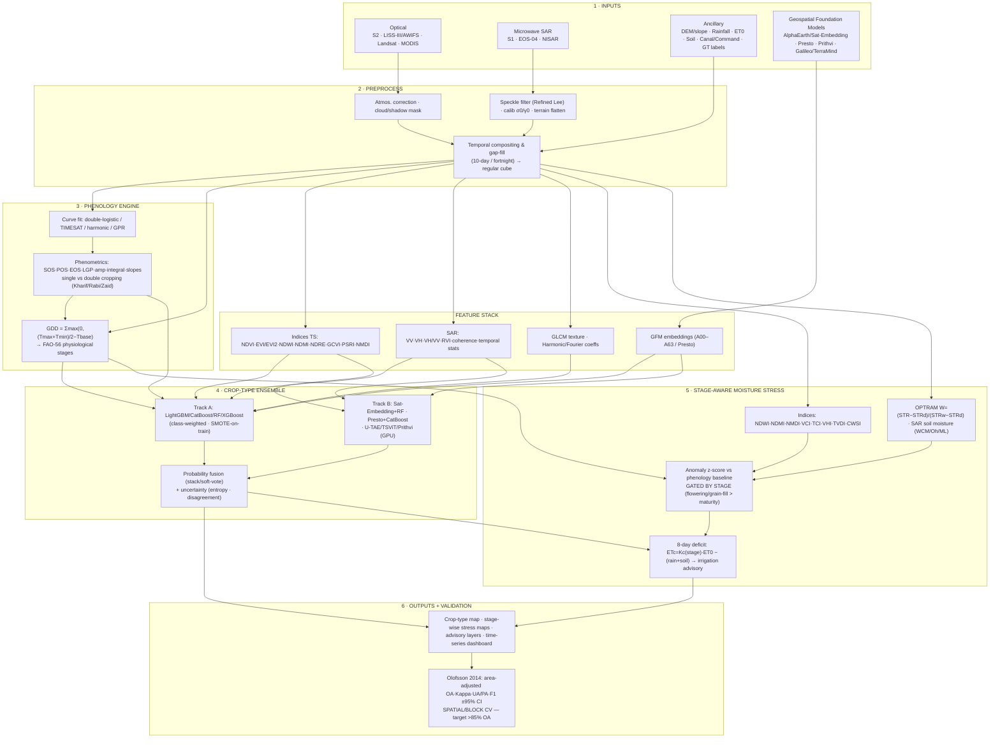

# MODELS.md — AI/ML Methodology for Crop-Type, Phenology & Stage-Aware Moisture-Stress

**Project:** AgriStress — ISRO Bharatiya Antariksh Hackathon (BAH) 2026, Problem Statement 6
**Scope:** AI-driven automated crop-type classification, stage-wise phenological mapping, and phenology-aware moisture-stress / crop-water-deficit detection from fused optical + microwave (SAR) satellite data.
**Accuracy target:** > 85 % Overall Accuracy (OA) with Kappa (κ) consistent with OA, validated under Olofsson (2014) good-practice. **Engineering goal: 88–93 % OA, κ 0.86–0.91.**

> This document is the **modelling/methodology spec**. It is deliberately model-rich: it gives a *guaranteed-to-clear-target* classical baseline, a deep-learning Satellite-Image-Time-Series (SITS) track, a geospatial-foundation-model (GFM) track for few-label robustness, the phenology engine, the moisture-stress engine, the label/validation protocol, and a recommended triple-track ensemble with compute-budget guidance. Irrigation-advisory (ETc / water-balance) logic is referenced where it consumes these outputs but is specified in a separate advisory doc.

---

## 0. Design Philosophy & Why This Clears 85 %

Three principles drive every choice below:

1. **Multi-temporal beats mono-temporal.** The single largest accuracy lever for crop typing is using the *whole season's trajectory* of spectral/SAR signatures, not one image. Published multi-temporal Sentinel-2 Random Forest studies routinely reach **90–97 % OA (κ 0.87–0.96)**; fused S1+S2+L8 reaches **~0.93 OA, κ 0.91**. A *single-date* classifier of the same crops typically sits 10–20 points lower. This is why our **floor** (Track A) is already a multi-temporal feature-stack RF/GBM, not a single-image classifier.
2. **The previous-season → current-season requirement (PS6 objective) is a phenology/transfer problem, not just a classifier problem.** We separate a **phenology engine** (when is each pixel in which physiological stage) from the **classifier** and the **stress detector**, so that the *same architecture* answers "what crop", "what stage", and "is it stressed *for that stage*".
3. **Stage-awareness is the differentiator for stress.** A fixed NDWI/NDVI threshold flags healthy senescing crops as "stressed". Gating every stress index by the pixel's *physiological stage* (flowering/grain-fill are far more vulnerable than maturity) is the methodological novelty that makes the stress layer *credible for command-area planning* (an explicit PS6 evaluation parameter).

The result is a **triple-track ensemble** (Section 7): a tabular GBM that ships first and clears target, a foundation-model / deep-SITS track that raises the ceiling and is robust when labels are scarce, and a phenology-gated stress track. We fuse class probabilities and emit per-pixel uncertainty.

---

## 1. Classical ML Baseline — Multi-Temporal Feature-Stack (Guaranteed > 85 %)

This is **Track A**: the reliable workhorse that is fast to train on CPU, interpretable (feature importances), and the basis of our 30-hour deliverable. It is the model most likely to *guarantee* clearing the 85 % bar because the literature is unambiguous that gradient-boosted trees / RF on a rich multi-temporal feature stack hit 90 %+ when labels are representative.

### 1.1 The Feature Stack (per pixel or per parcel)

Build a season-long, gap-filled, regularly-sampled (e.g. 10-day or fortnightly) cube, then collapse the temporal axis into engineered features. Six families:

**(a) Optical spectral bands (time series).** Sentinel-2 L2A surface reflectance (B2,B3,B4,B5,B6,B7,B8,B8A,B11,B12), LISS-III / AWiFS, Landsat-8/9 OLI, MODIS — all atmospherically corrected, cloud/shadow-masked (s2cloudless / QA60 / Fmask), harmonized to a common grid and sampling cadence.

**(b) Spectral indices (time series).** Each computed at every timestep, then summarized:

| Index | Formula | Sensitivity |
|---|---|---|
| **NDVI** | (NIR−Red)/(NIR+Red) | Greenness / canopy vigour, phenology backbone |
| **EVI / EVI2** | EVI = 2.5·(NIR−Red)/(NIR+6·Red−7.5·Blue+1); EVI2 = 2.5·(NIR−Red)/(NIR+2.4·Red+1) | Saturation-resistant biomass; EVI2 needs no blue band |
| **NDWI (Gao)** | (NIR−SWIR1)/(NIR+SWIR1) | Vegetation/canopy **water content** |
| **NDMI** | (B8A−B11)/(B8A+B11) | Canopy moisture (narrow-NIR vs SWIR1) |
| **NDRE** | (NIR−RedEdge)/(NIR+RedEdge) | Chlorophyll / N status, less saturating than NDVI |
| **GCVI** | (NIR/Green)−1 | Green chlorophyll vegetation index, LAI proxy |
| **PSRI** | (Red−Green)/RedEdge2 | Plant **senescence**, carotenoid/chlorophyll ratio |
| **NMDI** | (NIR−(SWIR1−SWIR2))/(NIR+(SWIR1−SWIR2)) | Soil & vegetation moisture (uses both SWIR) |

(NDRE/GCVI/PSRI require the Sentinel-2 red-edge bands; for LISS-III/AWiFS drop red-edge-dependent indices and lean on NDVI/EVI2/NDWI/NMDI.)

**(c) SAR features (Sentinel-1 GRD / EOS-04 / NISAR-SAR; time series).** All-weather backbone for cloudy Kharif/monsoon. After thermal-noise removal, radiometric calibration to γ⁰/σ⁰, terrain flattening, and **speckle filtering (Refined Lee / Lee-Sigma, or multi-temporal speckle filter)**:
- **VV, VH** backscatter (dB).
- **VH/VV ratio** (and VV−VH in dB): structure/biomass sensitive, good crop separator.
- **RVI** (Radar Vegetation Index) = 4·VH/(VV+VH) (dual-pol form): vegetation density, scales 0→1 over the season.
- **Temporal statistics** per polarization: mean, std, min, max, range, slope — capture the SAR seasonal envelope.
- **Coherence** (from SLC interferometric pairs, if available): low coherence over actively growing/irrigated crops vs high over bare/fallow; strong for sowing/harvest dating.

**(d) GLCM texture.** Grey-Level Co-occurrence Matrix on key dates (peak greenness, and a SAR date): contrast, correlation, entropy, homogeneity, ASM, variance. Texture disambiguates structurally different crops (e.g. row vs broadcast, orchard vs field) and helps where spectra overlap.

**(e) Phenometrics (from the phenology engine, Section 4).** Per-pixel **SOS, POS, EOS, Length-of-Growing-Period (LGP)**, seasonal **amplitude**, **integral (area under NDVI curve = cumulative greenness ≈ biomass proxy)**, **green-up slope** and **senescence slope**, number of cropping cycles (single vs double). These are *the* features that encode "crop calendar" and are highly discriminative between crops with different growth windows (e.g. short-duration vs long-duration rice, wheat vs mustard).

**(f) Harmonic / Fourier features.** Fit a harmonic regression to each index time series:
NDVI(t) ≈ a₀ + Σₖ [aₖ·cos(2πk·t/T) + bₖ·sin(2πk·t/T)], k=1..3.
Use the coefficients (a₀, a₁, b₁, a₂, b₂, …), amplitudes √(aₖ²+bₖ²), and phases atan2(bₖ,aₖ) as compact, cloud-robust descriptors of the seasonal shape. (This is the **CCDC / harmonic** trick — it regularizes irregular optical sampling and is very GEE-friendly.)

**(g) Ancillary / environmental.** DEM (SRTM/Copernicus/CartoDEM) elevation, slope, aspect; **GDD** accumulation; rainfall (IMD/CHIRPS), reference ET, soil texture, command-area / canal layers. These add agro-ecological context (e.g. rice in low-slope, water-rich pixels).

> **Pixel-vs-parcel.** Where farm/field boundaries exist (e.g. India national farm-boundary layers, FASAL/NRSC plots), aggregate features **per parcel** (mean + std + percentiles inside the polygon). Parcel-level classification is both more accurate and the natural unit for advisories. Otherwise classify per pixel and post-process with a parcel/segmentation majority vote.

### 1.2 Models

Train and compare four gradient-tree learners; they are strong, fast, and handle mixed-scale tabular features without normalization:

- **Random Forest** — robust default, near-zero tuning, excellent feature-importance interpretability. **GEE-native** via `ee.Classifier.smileRandomForest(numberOfTrees=300‑500)` for server-side, country-scale inference.
- **XGBoost** — strong tabular performer; documented crop-typing up to **~87.8 % OA**; supports monotonic constraints and GPU.
- **LightGBM** — fastest to train, histogram-based, leaf-wise growth; **our default "ship-first" learner** on large feature stacks.
- **CatBoost** — ordered boosting, superb with categorical ancillary features (soil class, agro-eco zone), strong default regularization, and **built-in robustness to class imbalance** (`auto_class_weights`).

### 1.3 Class-Imbalance Handling (crops are never balanced)

- **Class-weighted loss**: `class_weight="balanced"` (RF), `scale_pos_weight` / per-class weights (XGBoost/LightGBM), `auto_class_weights="Balanced"` (CatBoost). **First and safest choice.**
- **CatBoost** specifically degrades gracefully on skew — prefer it for long-tail minority crops.
- **SMOTE / SMOTE-NC / Borderline-SMOTE**: synthetic oversampling **applied to the training folds only**, *never* before the CV split and *never* to validation/test (else leakage inflates OA). Combine with mild majority undersampling (SMOTEENN) if a crop dominates >50 %.
- **Stratified sampling** of training points across crops *and* agro-eco zones so minority crops and rare landscapes are represented.

### 1.4 Hyperparameters (good starting grid)

**Random Forest (smileRandomForest / sklearn):** `n_estimators 300–500`, `max_features = sqrt(n)` (or `0.3–0.5` of features), `min_samples_leaf 3–5`, `max_depth None` (or 20–30 to control overfit), `class_weight balanced`, bootstrap on; in GEE set `variablesPerSplit ≈ sqrt(nFeatures)`, `minLeafPopulation 3`, `bagFraction 0.7`.

**LightGBM:** `num_leaves 31–127`, `max_depth 6–12`, `learning_rate 0.03–0.1`, `n_estimators 500–2000` with `early_stopping_rounds 50`, `feature_fraction 0.7`, `bagging_fraction 0.8 + bagging_freq 1`, `min_child_samples 20–50`, `lambda_l1/l2 0–5`, `class_weight balanced`, objective `multiclass` / `multiclassova`.

**XGBoost:** `max_depth 6–10`, `eta 0.03–0.1`, `n_estimators 500–1500 + early stopping`, `subsample 0.8`, `colsample_bytree 0.7`, `min_child_weight 1–5`, `gamma 0–2`, `reg_lambda 1–5`, objective `multi:softprob`, `tree_method hist/gpu_hist`.

**CatBoost:** `depth 6–10`, `learning_rate 0.03–0.1`, `iterations 1000–3000 + od_wait 50`, `l2_leaf_reg 3–10`, `auto_class_weights Balanced`, `loss_function MultiClass`, `border_count 128`.

Tune with **spatial/blocked CV** (Section 6.4), optimizing macro-F1 (not raw OA) so minority crops are not sacrificed. Use Optuna/`RandomizedSearchCV` over the grids above.

### 1.5 Documented Accuracies (the evidence floor)

| Configuration | Reported performance | Source family |
|---|---|---|
| Multi-temporal **Sentinel-2 + RF** | **OA 90–97 %, κ 0.87–0.96** | Multiple peer-reviewed multi-temporal S2 RF studies |
| **Fused S1 + S2 + L8 + RF** | **OA ~0.93, κ 0.91** | Optical+SAR fusion studies |
| **XGBoost** on multi-temporal stack | **OA up to ~87.8 %** | Tabular boosting crop-typing studies |
| Single-date optical classifier (anti-pattern) | typically 70–85 % | — (why we never ship mono-temporal) |

**Conclusion:** a multi-temporal feature-stack RF/GBM with representative labels is *expected* to clear 85 % comfortably; that is why Track A is the guaranteed floor.

### 1.6 GEE Reference Snippet (server-side, scalable)

```javascript
// Build season feature stack 'stack' (S2 indices + S1 SAR + harmonics + phenometrics + DEM/GDD)
var training = stack.sampleRegions({collection: labels, properties: ['crop'], scale: 10, tileScale: 8});
var rf = ee.Classifier.smileRandomForest({numberOfTrees: 400, variablesPerSplit: null,
          minLeafPopulation: 3, bagFraction: 0.7}).setOutputMode('MULTIPROBABILITY');
var model = rf.train({features: training, classProperty: 'crop', inputProperties: stack.bandNames()});
var cropMap = stack.classify(model);   // near-O(1) inference at scale
```
(`smileGradientTreeBoost` and `smileKNN` are the in-engine GBM/kNN alternatives; for true XGBoost/LightGBM/CatBoost, export features and train in Python.)

---

## 2. Deep Learning for Satellite Image Time Series (SITS)

**Track B (deep branch).** When GPU is available and labels are moderate, deep SITS models learn the temporal shape end-to-end (no hand-crafted phenometrics) and typically add a few points of OA and better minority-crop recall — at the cost of data hunger and compute.

### 2.1 Families

- **TempCNN / 1D-CNN.** Temporal convolutions over each pixel's index/band time series. Simple, fast, strong baseline; robust to limited data; good first deep model. (Pelletier et al.)
- **RNNs — LSTM / GRU / BiLSTM.** Model temporal dependencies of the growth trajectory; BiLSTM sees past+future context within the season. PS6 explicitly names LSTM/TempCNN. Solid per-pixel temporal classifiers.
- **Attention — PSE+TAE and L-TAE.** **Pixel-Set Encoder (PSE)** samples a *set* of pixels inside a parcel (permutation-invariant, no need for fixed shapes) → **Temporal Attention Encoder (TAE)** / **Lightweight-TAE (L-TAE)** attends over dates. PSE+L-TAE is a **parcel-level SoTA**, very parameter-efficient, and ideal where farm boundaries exist. (Garnot & Landrieu.)
- **U-TAE (U-Net + Temporal Attention).** Spatio-temporal *segmentation*: a U-Net encoder with temporal-attention blocks collapses the time dimension into per-pixel maps. On **PASTIS** it reaches **63.1 mIoU** (semantic), and with the **PaPs (Parcels-as-Points)** head does **panoptic** crop segmentation at **40.4 PQ** — i.e. it both labels and *delineates* individual parcels.
- **TSViT (Temporo-Spatial ViT).** A fully-attentional, **factorized temporo-spatial transformer** purpose-built for SITS; introduces acquisition-time-specific temporal position encoding. **Beats U-TAE** (e.g. **~65.4 % mIoU on PASTIS24** with ~1.6 M params). Strong choice on a capable GPU. (Tarasiou et al.)
- **3D-CNN / ConvLSTM.** Joint space-time convolution / convolutional recurrence; good when both spatial texture and temporal dynamics matter, but heavier and more data-hungry.

### 2.2 Benchmark

**PASTIS / PASTIS-R** (France, Sentinel-2 [+ Sentinel-1 radar in -R], 18 crop classes, panoptic annotations) is the reference SITS benchmark used by U-TAE, PaPs and TSViT. Use it for architecture sanity-checks and pretraining before fine-tuning on Indian labels.

### 2.3 Strengths / Data-Needs / Accuracy

| Model | Unit | Key strength | Data need | Reported |
|---|---|---|---|---|
| TempCNN / 1D-CNN | pixel | simple, fast, robust | low–moderate | strong baseline |
| LSTM / GRU / BiLSTM | pixel | temporal dependency, named in PS6 | moderate | strong |
| PSE + (L-)TAE | **parcel** | param-efficient, parcel SoTA | moderate (needs boundaries) | SoTA per-parcel |
| **U-TAE (+PaPs)** | pixel→parcel | semantic **and** panoptic (delineation) | moderate–high | **63.1 mIoU / 40.4 PQ (PASTIS)** |
| **TSViT** | patch | best accuracy, factorized attention | high | **~65.4 mIoU (PASTIS24)**, beats U-TAE |
| 3D-CNN / ConvLSTM | patch | joint space-time | high | competitive, heavier |

**When to use deep SITS:** GPU available, ≥ few-thousand labelled parcels (or use a GFM, Section 3, to cut the label need). On CPU-only / tiny-label budgets, **stay on Track A** or use Track-B-via-GFM.

---

## 3. Geospatial Foundation Models (Few-Label Robustness)

**Track B (foundation branch).** GFMs are pre-trained (mostly self-supervised) on massive unlabelled EO archives, then adapted with *very few* labels — the single best lever when ground truth is scarce, which is the operational reality in India. Two deployment patterns recur:

- **Pattern (A) — precomputed embeddings + light classifier.** Sample a frozen GFM's embeddings at your label points, train RF/kNN/logistic/CatBoost on top. **Cheapest, near-O(1), no GPU needed for inference**, scales to national extent. This is the **WorldCereal design** (CatBoost on Presto features) and the **AlphaEarth/Satellite-Embedding** workflow.
- **Pattern (B) — fine-tune the backbone.** Unfreeze (or LoRA/decoder-tune) the GFM on your task. **Highest accuracy ceiling**, needs a GPU and more labels.

### 3.1 Google **Satellite Embedding / AlphaEarth Foundations**
`GOOGLE/SATELLITE_EMBEDDING/V1/ANNUAL` — a global, analysis-ready **64-dimensional, 10 m** embedding (bands **A00–A63**), one vector per pixel **per year (2017→present)**, produced by DeepMind's **AlphaEarth Foundations** model fusing Sentinel-1, Sentinel-2, Landsat, radar, optical and climate data. Each pixel is a **unit vector** on a 64-D hypersphere, so dot-product/cosine = similarity (clean cluster boundaries because spatial context is baked in).
**Use:** `sampleRegions` the embedding at labels → `ee.Classifier.smileRandomForest` / `smileKNN` / logistic → **near-O(1) crop classification at scale**, entirely in GEE, with *zero* feature engineering. Excellent strong-baseline and ideal for the previous-season map.
**Caveat (critical for PS6):** the *Harvesting AlphaEarth* agricultural benchmark (arXiv:2601.00857) finds AEF embeddings **competitive with purpose-built RS models when trained on local data, but with weaker spatial transferability, lower interpretability, and limited time-sensitivity**. **Therefore: use the *annual* embedding for the crop-type map, but do NOT use annual embeddings alone for *within-season* moisture stress** — stress needs sub-seasonal temporal signal the annual vector does not carry. Stress runs on the raw S1/S2 time series + OPTRAM/indices (Section 5).

### 3.2 **Presto** (Pretrained Remote Sensing Transformer)
Tiny (**~1000× fewer params** than image GFMs), trained by **masked autoencoding on multi-sensor pixel time series** (S1, S2, ERA5, DEM, etc.). **Robust to missing sensors/timesteps** (directly handles cloudy gaps), MIT-licensed. **Freeze → RF/CatBoost** = exactly the WorldCereal recipe. Best fit for PS6 because it is *temporal* and *pixel-native* (unlike annual AlphaEarth) — so it can feed *both* crop-typing **and** stage-aware stress. Runs on modest hardware. (arXiv:2304.14065.)

### 3.3 **Prithvi-EO-2.0** (IBM–NASA)
**300 M / 600 M** ViT pretrained on **HLS (Harmonized Landsat-Sentinel)** with **3D patch embeddings + temporal & location embeddings** (multi-temporal aware). Reports **50.7 % mIoU on US multi-temporal crop segmentation** and **84.6 weighted-F1 on Sen4Map** land cover; consistently beats the ViViT baseline. **Fine-tune via TerraTorch** (Pattern B). Use when a GPU is available and you want the highest segmentation ceiling. (arXiv:2412.02732; weights on Hugging Face.)

### 3.4 Others (baselines / specialist alternatives)
- **Galileo** (NASA Harvest) — highly **multimodal** (optical, SAR, elevation, weather, pseudo-labels), **global + local** masked-modelling features; a *single generalist* model **beats specialists across 11 benchmarks** and pixel-time-series tasks. Strong multimodal alternative. (arXiv:2502.09356.)
- **TerraMind** (IBM/ESA) — **any-to-any generative** multimodal GFM that can **infer missing modalities** (e.g. synthesize SAR-like or optical-like features when one is cloud-blocked); outperformed 12 EO FMs by ≥8 % on PANGAEA. Useful for cloudy-Kharif gap-filling. (ICCV 2025.)
- **Clay**, **SatMAE**, **Scale-MAE**, **DOFA** — additional self-supervised EO backbones to use as embedding sources / ablation baselines.

### 3.5 Choosing a GFM for PS6

| Need | Pick | Pattern |
|---|---|---|
| Fastest national crop map, no GPU | **Satellite Embedding (AlphaEarth)** + RF/kNN in GEE | A |
| Few labels **and** must feed stress (temporal) | **Presto** → RF/CatBoost | A |
| Highest seg ceiling, GPU available | **Prithvi-EO-2.0** (TerraTorch) / TSViT / U-TAE | B |
| Cloudy Kharif, missing-modality robustness | **TerraMind / Galileo** | A or B |

---

## 4. Phenology Engine & Stage-Awareness (the PS6 backbone)

This engine answers **"when is each pixel in which physiological stage?"** It powers (i) phenometric features for the classifier, (ii) the previous→current-season transfer, and (iii) the *gate* for stage-specific stress.

### 4.1 Per-pixel curve fitting → phenometrics
Reconstruct a smooth NDVI/EVI trajectory per pixel and extract land-surface phenology:
- **Double-logistic** fit (Beck/Elmore form) — robust seasonal shape, handles green-up + senescence.
- **TIMESAT** (double-logistic / asymmetric-Gaussian / Savitzky-Golay) — the standard phenometrics toolbox.
- **Harmonic / Fourier** (Section 1f) — cloud-robust, GEE-native.
- **GPR (Gaussian Process Regression)** — smooth gap-filling with uncertainty bands; excellent for irregular/cloudy optical series.

From the fitted curve derive **SOS** (start), **POS** (peak), **EOS** (end), **LGP** (length), **amplitude**, **integral**, **green-up & senescence slopes**.

### 4.2 Single vs double cropping & Indian seasons
Count NDVI peaks per agricultural year to distinguish **single vs double (vs triple) cropping** and assign each cycle to **Kharif** (monsoon, ~Jun–Oct), **Rabi** (winter, ~Nov–Apr), or **Zaid** (summer, ~Mar–Jun). This is essential in India where the same pixel grows different crops across seasons, and it disambiguates the *current* season's crop from the *previous* season's signature (PS6 objective). SAR coherence/backscatter dating refines sowing/harvest under monsoon cloud.

### 4.3 GDD → physiological stages
Land-surface phenology gives the *envelope*; **Growing Degree Days** map it to *physiology*:

**GDD = Σ max(0, ((T_max + T_min)/2 − T_base))** accumulated from sowing (T_base crop-specific, e.g. ~10 °C maize, ~0–5 °C wheat; with optional upper cap).

Then apply **FAO-56 (revised) GDD-based / crop-coefficient stage lengths** to segment the season into physiological stages — **initial → development (vegetative) → mid-season (flowering / reproductive, grain-fill) → late-season (maturity/senescence)** — and align them with the RS-derived SOS/POS/EOS. The output is a per-pixel **stage label time series** that feeds Kc (for ETc/advisory) *and* the stress gate.

### 4.4 Stage-specific stress thresholds (the differentiator)
Crop water sensitivity is **stage-dependent**: **flowering and grain-fill are far more vulnerable than maturity/senescence** (FAO Ky yield-response coefficients are largest at flowering). So the stress engine uses **stage-conditioned thresholds**: the same NDWI/NMDI/OPTRAM value that is *alarming during flowering* may be *normal during maturity* (where canopy drying is expected). This stage-gating is what separates a credible advisory from naive fixed-threshold flagging — and directly satisfies the PS6 requirement that *"moisture-stress classification be growth-stage aware."*

---

## 5. Moisture / Water-Stress Detection

Multiple complementary stress indicators, **fused** and **gated by stage** (Section 4.4), then framed as an **anomaly vs the pixel's own phenological baseline** (Section 5.4). Optical for clear days, SAR for cloudy monsoon.

### 5.1 Index table

| Index | Formula | Reads | Notes |
|---|---|---|---|
| **NDWI (Gao)** | (NIR−SWIR1)/(NIR+SWIR1) | canopy water | vegetation liquid water |
| **NDMI** | (B8A−B11)/(B8A+B11) | canopy moisture | narrow-NIR vs SWIR1 |
| **NMDI** | (NIR−(SWIR1−SWIR2))/(NIR+(SWIR1−SWIR2)) | soil+veg moisture | both SWIR bands |
| **VCI** | 100·(NDVI−NDVI_min)/(NDVI_max−NDVI_min) | greenness anomaly | per-pixel historical min/max; drought |
| **TCI** | 100·(LST_max−LST)/(LST_max−LST_min) | thermal anomaly | hot = stressed |
| **VHI** | α·VCI + (1−α)·TCI (α≈0.5) | combined veg+thermal | classic drought composite |
| **TVDI** | (LST−LST_min)/(LST_max(NDVI)−LST_min) | surface dryness | from LST–NDVI triangle, [0..1] |
| **CWSI** | (dT−dT_LL)/(dT_UL−dT_LL) | canopy water stress | dT=Tc−Ta; LL=well-watered, UL=non-transpiring |

(VCI/TCI/VHI need a multi-year NDVI/LST climatology for per-pixel min/max; LST from Landsat/MODIS/ECOSTRESS.)

### 5.2 **OPTRAM** — pure-optical soil moisture (Sentinel-2-friendly)
The **OPtical TRApezoid Model** derives soil moisture from optical data alone — ideal where no thermal band is available at S2 resolution.
- **STR (SWIR Transformed Reflectance)** = (1 − R_SWIR)² / (2 · R_SWIR), linearly related to soil moisture.
- Plot **NDVI (x) vs STR (y)**: pixels form a **trapezoid**; fit a **dry edge** (STR_d = i_d + s_d·NDVI) and **wet edge** (STR_w = i_w + s_w·NDVI).
- **W = (STR − STR_d) / (STR_w − STR_d) ∈ [0,1]** — normalized soil-moisture (0 = dry edge, 1 = wet edge).
- **Calibrate the edges per land-cover / agro-eco zone** (land-cover-specific calibration materially improves accuracy — Frontiers, Central Valley study). Validated against S2, Landsat-8 and MODIS.
OPTRAM gives a **root-zone-adjacent soil-moisture layer** that complements canopy indices and feeds the water-deficit step.

### 5.3 SAR soil moisture
SAR backscatter (σ⁰) responds to surface soil moisture (dielectric constant) once vegetation is accounted for:
- **Water-Cloud-Model (WCM)** to separate soil vs vegetation contributions (vegetation descriptor from NDVI/LAI).
- **Dubois** / **Oh** semi-empirical bare-soil inversion models.
- **ML regression** (RF/GBM/NN) mapping S1 VV/VH (+ incidence angle, NDVI) → in-situ soil moisture — the most flexible operational route. Critical for **cloudy Kharif** when optical is blind.

### 5.4 Anomaly detection vs phenology baseline (gated by stage)
The decisive step: instead of thresholding raw indices, compute **z-scores against each pixel's own expected phenological trajectory**:
- Build the expected NDVI/NDWI/NMDI/OPTRAM-W value for the pixel's *current stage* (from its historical double-logistic baseline / VCI climatology).
- **z = (observed − expected) / σ_baseline**; a strong negative z (e.g. observed greenness/moisture well below the stage norm) flags stress.
- **Gate by stage:** require lower (more sensitive) thresholds at **flowering/grain-fill** and looser thresholds at **maturity** (where decline is normal). Fuse optical-z, OPTRAM-W and SAR-σ⁰-z into a **stage-aware stress class** (e.g. None / Mild / Moderate / Severe).
This yields stress maps that *track the crop calendar*, not the season's natural senescence — the credibility bar PS6 sets. The resulting deficit feeds the **8-day ETc / water-balance advisory** (specified in the advisory doc): ETc = Kc(stage)·ET₀; deficit = ETc − (effective rainfall + soil-moisture supply) → irrigation status map.

---

## 6. Labels & Validation

### 6.1 Label sources
**India:** **NRSC / Bhuvan** *In-situ Photo Upload (IPU)* app for crop GT points; **FASAL** crop-inventory plots; **Bhuvan Kharif / Rabi cropland** layers; national **farm-boundary** datasets; **UPAg** agricultural statistics for area priors.
**Global / transfer:** **WorldCereal** in-situ reference DB; **EuroCrops / EuroCropsML**; **USDA CDL** (US); **PASTIS / PASTIS-R**; **CropHarvest** (global crop/non-crop time series). These enable pretraining, transfer and benchmarking when local labels are thin.

### 6.2 Few-label strategies
- **Transfer learning** from a GFM (Section 3) or from CDL/EuroCrops-trained models.
- **Semi-supervised** (pseudo-labelling confident predictions, consistency regularization, FixMatch-style).
- **Active learning** — label the pixels/parcels where the ensemble is *most uncertain* (entropy/disagreement) to spend scarce annotation budget optimally.

### 6.3 Augmentation
- **Optical:** temporal jitter (shift sampling dates), band dropout, **cloud simulation** (inject realistic cloud/shadow gaps so the model learns gap-robustness), **mixup**, additive noise.
- **SAR:** **speckle** injection (multiplicative noise), **VV/VH dropout** (train missing-pol robustness), small radiometric shifts.
These directly improve robustness to the cloudy, irregular reality of Indian Kharif acquisitions.

### 6.4 Validation — Olofsson (2014) good practice (mandatory)
Report accuracy the *right* way, not just naive OA:
1. **Stratified reference sample** (strata = map classes), with sample size allocated by expected accuracy/area.
2. **Confusion / error matrix expressed in *area proportions*** (weight rows by mapped area), not raw pixel counts.
3. Report **OA, Kappa, and per-class User's (UA) & Producer's (PA) accuracy + F1.**
4. **Area-adjusted (bias-corrected) accuracy estimates with 95 % confidence intervals** — the headline numbers for an operational product.
5. **Spatial / block (or grouped) cross-validation** — split by spatially disjoint blocks/tiles so train and test never share neighbouring pixels. **Random pixel splits leak spatial autocorrelation and inflate OA by 5–15 points** — a classic crop-mapping trap; we avoid it everywhere (including Section 1.4 tuning).
6. **Kappa caveat:** report κ for tradition/PS6 compliance, but treat OA + per-class F1 + area-adjusted CIs as the primary evidence (κ is known to be confounded by class prevalence and is increasingly deprecated as a sole metric).

---

## 7. Recommended Stack — Triple-Track Ensemble

A **three-track**, fuse-at-the-end design that *ships something that clears target on day one* and *raises the ceiling* as compute/labels allow.

**Track A — Tabular GBM (ship first; clears target).**
Multi-temporal feature-stack **LightGBM / CatBoost** (Section 1). CPU-trainable, interpretable, expected **≥ 90 % OA** with representative labels. **This alone satisfies PS6's > 85 % bar.** Deploy server-side at scale via `smileRandomForest` in GEE for the country/command-area map.

**Track B — Foundation / Deep-SITS (raise ceiling; few-label robust).**
- Default: **Satellite-Embedding (AlphaEarth) + RF** (Pattern A, near-O(1), no GPU) for the previous-season map, **and/or Presto + CatBoost** (temporal, missing-sensor robust) so it can feed stress too.
- If GPU: add **Prithvi-EO-2.0** (TerraTorch) and/or **U-TAE / TSViT** for spatio-temporal segmentation + parcel delineation.

**Track C — Phenology-gated stress (Sections 4–5).**
Phenology engine → per-pixel stage → stage-aware fused stress (OPTRAM-W + NDWI/NMDI + SAR + VHI), as anomaly vs phenological baseline → stress class + 8-day deficit → advisory.

**Fusion & uncertainty.**
Combine Track-A and Track-B **class probabilities** (soft-voting / stacking with a logistic meta-learner; weight by per-class CV F1). Emit per-pixel **uncertainty** from (i) **ensemble disagreement** and (ii) **class-probability entropy**; high-uncertainty pixels are flagged for review / active-learning and shown on the dashboard. **Expected fused performance: 88–93 % OA, κ 0.86–0.91.**

### 7.1 Model selection by compute budget

| Budget | Crop-type | Stress | Notes |
|---|---|---|---|
| **No GPU** | LightGBM/CatBoost stack **+** Satellite-Embedding+RF (GEE) | OPTRAM + NDWI/NMDI + SAR-ML, stage-gated | Fully CPU/GEE; clears target; the safe hackathon path |
| **One GPU** | add **Presto+CatBoost** and **U-TAE** *or* **TSViT** | + SAR soil-moisture NN | Best accuracy/effort; parcel delineation via U-TAE+PaPs |
| **Strong GPU** | **Prithvi-EO-2.0 fine-tune (TerraTorch)** + TSViT ensemble | + TerraMind/Galileo gap-filling | Highest ceiling; fine-tune Pattern B; multimodal cloud robustness |

> **Recommended hackathon path:** ship **Track A (LightGBM/CatBoost) + Satellite-Embedding+RF** first (guarantees the deliverable and the > 85 % bar), then layer **Presto+CatBoost** and the **phenology-gated stress** track, and add **U-TAE/TSViT/Prithvi** only if GPU time remains.

---

## 8. Architecture Diagram



---

## 9. Consolidated References (with URLs)

**Classical ML / multi-temporal RF & phenometrics**
- Multi-temporal Sentinel-2 RF crop mapping (90–97 % OA, κ 0.87–0.96) and S1+S2+L8 fusion (~0.93 OA, κ 0.91) — representative peer-reviewed studies, e.g. *Remote Sensing of Environment / Remote Sensing (MDPI)* crop-typing literature. GEE classifier: https://developers.google.com/earth-engine/apidocs/ee-classifier-smilerandomforest
- TIMESAT phenology toolbox: https://web.nateko.lu.se/timesat/timesat.asp

**Deep SITS / benchmarks**
- U-TAE & PaPs (panoptic SITS, 63.1 mIoU / 40.4 PQ): Garnot & Landrieu, *Panoptic Segmentation of Satellite Image Time Series* — https://arxiv.org/abs/2107.07933 ; code https://github.com/VSainteuf/utae-paps
- PASTIS / PASTIS-R benchmark: https://github.com/VSainteuf/pastis-benchmark
- TSViT (factorized temporo-spatial transformer, ~65.4 mIoU PASTIS24): Tarasiou et al., CVPR 2023 — https://arxiv.org/abs/2301.04944
- TempCNN: Pelletier et al. — https://www.mdpi.com/2072-4292/11/5/523 ; PSE+TAE/L-TAE: Garnot et al. — https://arxiv.org/abs/2007.00586

**Geospatial Foundation Models**
- AlphaEarth Foundations / Satellite Embedding: DeepMind — https://deepmind.google/blog/alphaearth-foundations-helps-map-our-planet-in-unprecedented-detail/ ; GEE intro — https://developers.google.com/earth-engine/tutorials/community/satellite-embedding-01-introduction
- *Harvesting AlphaEarth* (agriculture benchmark; weaker transfer/interpretability/time-sensitivity): arXiv:2601.00857 — https://arxiv.org/abs/2601.00857
- Presto (lightweight pretrained RS timeseries transformer): arXiv:2304.14065 — https://arxiv.org/abs/2304.14065
- WorldCereal deployment of GFMs (Presto→CatBoost design): arXiv:2508.00858 — https://arxiv.org/abs/2508.00858
- Prithvi-EO-2.0 (300M/600M, HLS, 50.7 mIoU crop seg, 84.6 wF1 Sen4Map): arXiv:2412.02732 — https://arxiv.org/abs/2412.02732 ; weights — https://huggingface.co/ibm-nasa-geospatial/Prithvi-EO-2.0-600M-TL ; TerraTorch — https://github.com/IBM/terratorch
- Galileo (multimodal, beats specialists on 11 benchmarks): arXiv:2502.09356 — https://arxiv.org/abs/2502.09356 ; code https://github.com/nasaharvest/galileo
- TerraMind (any-to-any generative, infers missing modalities): ICCV 2025 — https://arxiv.org/abs/2504.11171
- Clay — https://clay-foundation.github.io/model/ ; SatMAE — https://arxiv.org/abs/2207.08051 ; Scale-MAE — https://arxiv.org/abs/2212.14532 ; DOFA — https://arxiv.org/abs/2403.15356

**Phenology & GDD / stage lengths**
- FAO-56 Crop Evapotranspiration (Kc, growth stages, Ky): https://www.fao.org/4/x0490e/x0490e00.htm
- Double-logistic land-surface phenology: Beck et al. (2006), *RSE*; Elmore et al. (2012).

**Moisture / water stress**
- OPTRAM (Sadeghi et al., optical trapezoid soil moisture): https://www.sciencedirect.com/science/article/pii/S003442571830186X ; land-cover-specific calibration (Central Valley): https://www.frontiersin.org/journals/remote-sensing/articles/10.3389/frsen.2025.1519420/full
- VHI / VCI / TCI (Kogan): https://doi.org/10.1016/0273-1177(95)00079-T
- CWSI (Idso/Jackson canopy water stress index): Jackson et al. (1981), *Water Resources Research* — https://doi.org/10.1029/WR017i004p01133

**Labels & validation**
- Olofsson et al. (2014) *Good practices for estimating area and assessing accuracy of land change*, RSE: https://doi.org/10.1016/j.rse.2014.02.015
- WorldCereal — https://esa-worldcereal.org/ ; EuroCrops — https://github.com/maja601/EuroCrops ; CropHarvest — https://github.com/nasaharvest/cropharvest ; USDA CDL — https://www.nass.usda.gov/Research_and_Science/Cropland/SARS1a.php ; Bhuvan — https://bhuvan.nrsc.gov.in/
- **Farm-Level, In-Season Crop Identification for India** (S1+S2, 12 crops ≈90 % area, season-detection, in-season by ~2 months): arXiv:2507.02972 — https://arxiv.org/abs/2507.02972

---

*End of MODELS.md — AgriStress / ISRO BAH 2026 PS6.*
