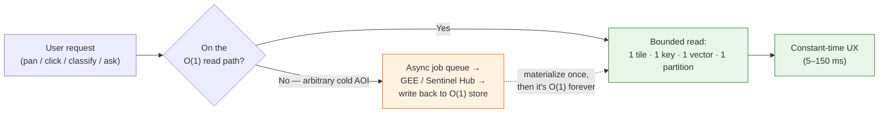
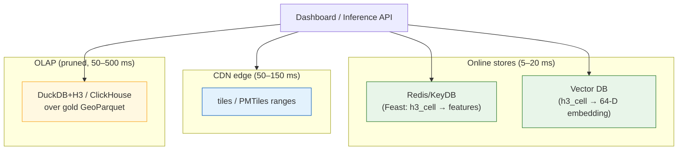
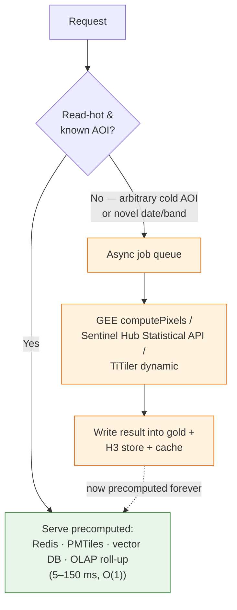
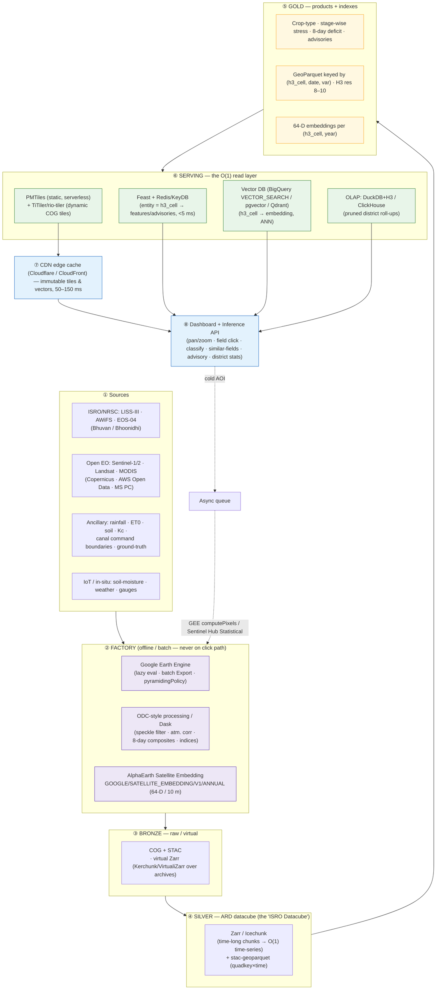

# PLATFORM_O1 — The Fastest-Platform "O(1) Access" Design for AgriStress

> **AgriStress** — ISRO Bharatiya Antariksh Hackathon 2026, **Problem Statement 6**:
> *AI-Driven Automated Crop-type & Moisture-Stress Detection and Irrigation Advisory Across Growth Stages Using Moderate-Resolution Optical & Microwave Satellite Data.*
>
> This document is the **platform / data-architecture** companion to `idea.md`. It answers one question:
> **How do we make every dashboard pan, every field click, every "classify this polygon" and every "is this field stressed?" feel instant — no matter whether the catalog holds one command area or all of India, ten dates or ten years?**

---

## 0. What "O(1)" Means Here (and What It Does Not)

We are **not** claiming the underlying physics, ML, or petabyte EO archive is O(1). We are claiming **user-perceived constant-time access**: the latency a user experiences for a dashboard/inference request is **bounded by a small constant**, *independent of catalog size, archive depth, or AOI extent*, because the heavy work has already been done before the click.

There are exactly **four mechanisms** by which we buy constant time. Every technique in this document is classified by which one it uses:

| # | Mechanism | One-line definition | Canonical example |
|---|-----------|---------------------|-------------------|
| **P** | **Precomputed** | The answer is materialized ahead of time; the request is a read. | Daily stress maps, materialized advisories, AlphaEarth embeddings |
| **I** | **Indexed** | A key function maps query → storage location in O(1); no scan. | H3 `latLngToCell`, Zarr `chunk_key = ⌊coord/chunk⌋`, COG tile offset |
| **T** | **Tiled** | Data is cut into fixed-size pieces; a viewport touches a *bounded* number. | XYZ/WMTS pyramid, COG overviews, PMTiles, map serving |
| **L** | **Lazy / pushed server-side** | Compute is deferred and pushed to the data; only the tiny result crosses the wire. | GEE lazy eval, Sentinel Hub Statistical API, OLAP partition pruning |

> **The golden rule of this platform:** *A request must touch a bounded amount of data regardless of how much data exists.*
> If a request's cost grows with catalog size or AOI area, it is **not** on the O(1) path and must be moved off it (precompute it, index it, tile it, or push it server-side and async).



---

## 1. Planetary-Scale Compute — The Offline FACTORY, Not the Live Storefront

The single most important architectural decision: **Google Earth Engine and other planetary-scale engines are the factory that produces our products. They are never in the user's click path.** They are batch, rate-limited, and tuned for throughput over latency. We mine them offline; we serve from cheap, indexed, tiled stores online.

### 1.1 Google Earth Engine (GEE) — lazy server-side evaluation

GEE's core trick is **lazy evaluation**: `ee.Image`/`ee.ImageCollection` objects are *computation graphs*, not data. Nothing executes until you request a concrete output (a tile, a number, a thumbnail). Earth Engine then plans the computation **server-side, beside the data**, and ships you only the result. Two consequences make it feel O(1)-ish *per tile*:

1. **Power-of-two tile pyramid.** Every GEE image is conceptually a pyramid of 256×256 tiles at zoom levels `z`. A map request for a given AOI/zoom asks for the tiles overlapping that viewport — a **bounded** number — so the per-tile cost is roughly **O(1) regardless of the global image extent**. This is the same quadtree logic as web maps.
2. **`getMapId` → XYZ tiles.** `getMapId()` returns a tile-fetch URL template; the browser then pulls `/{z}/{x}/{y}` tiles directly, each computed on demand and cached.

**Pull-the-pixels endpoints (for our factory jobs, not the UI):**

| Endpoint | Use | Hard limit |
|----------|-----|-----------|
| `ee.data.getPixels` | Read pixels from a stored asset | **≤ 48 MB** uncompressed/response; ≤ 32 768 px/dim; ≤ 1024 bands |
| `ee.data.computePixels` | Compute an expression → pixels | Same **48 MB** cap; exceeding → HTTP 400 |
| `getMapId` | XYZ/WMTS tile template for slippy maps | tile-by-tile |
| `getThumbId`/`getDownloadId` | Thumbnails / small exports | small |
| `Export.image.toCloudStorage`/`toAsset` | **Batch** export of full products | async, hours |

**On ingest: `pyramidingPolicy`.** When we ingest a product as an EE asset, we set the per-band overview rule (`MEAN`, `MODE`, `MIN/MAX`, `SAMPLE`). `MODE` for the categorical **crop-type** map (so a zoomed-out pixel = dominant crop, never a meaningless average); `MEAN` for continuous **stress/ET** layers. This is the *factory-side* analogue of COG overviews (§2.1).

**The high-volume endpoint** trades latency for parallelism — designed to fan out many requests, with **reduced caching** and **higher average latency**. Good for batch tile harvesting; *bad* for a single user waiting.

#### GEE hard limits → why it is the factory, not the storefront

| Limit | Value | Implication for AgriStress |
|-------|-------|----------------------------|
| Concurrent requests (high-volume) | **40** | Cannot back a public dashboard with concurrent users |
| Request rate (high-volume) | **100 req/s** (6 000/min) | Bursty viewport loads would exhaust quota |
| Request payload | **10 MB** | Big geometries must be assets, not inline |
| Pixel response | **48 MB** uncompressed | Tile/chunk the factory output |
| `FeatureCollection` aggregation | **5 000 elements** in many interactive ops | Big batches must be `Export`-ed, not computed live |
| Memory / compute timeout | "User memory limit exceeded" / timeouts | Heavy per-request graphs fail under load |

> **Decision:** GEE runs **scheduled batch jobs** (8-day composites, indices, stress, embeddings export) writing to GCS/S3 as **COG + Zarr**. The live platform never calls GEE synchronously on the hot path. The *only* synchronous GEE use is the **cold-AOI async escape hatch** (§7), behind a queue.

### 1.2 The rest of the factory floor (alternatives & complements)

| Platform | What it gives us | O(1) mechanism it enables downstream |
|----------|------------------|--------------------------------------|
| **Microsoft Planetary Computer + STAC** | STAC-indexed, COG-backed Sentinel/Landsat/MODIS on Azure; Hub for batch | **I** (STAC search → exact assets) + **T** (COGs) |
| **AWS Open Data / Earth Search** | Sentinel-2 COGs, Sentinel-1, etc. in `ap-south-1` (low latency to India users) | **T** (COG range reads) |
| **Sentinel Hub Statistical / Batch-Statistical API** | Server-side zonal stats over your polygons → **tiny JSON** time series; no pixels cross the wire | **L** (push compute to data; result is O(result), not O(pixels)) |
| **Open Data Cube (ODC)** | Indexed, gridded ARD datacube; the engine behind **Digital Earth Africa / Australia** | **I**+**T**; direct precedent for an **"ISRO/Bhuvan Datacube"** over LISS/AWiFS/EOS-04 |

**Why ODC matters for PS6:** Digital Earth Africa and Digital Earth Australia prove the pattern of a *national, operational, analysis-ready datacube* serving thousands of users. Our silver layer (§ recommended architecture) is effectively an **ISRO datacube**: ARD on a fixed grid, queried by `(tile, time, band)` — an indexed lookup, not a scan.

---

## 2. Cloud-Native Formats — O(1) *Access* Inside Big Files

Format is destiny. A "normal" GeoTIFF/NetCDF forces you to download the whole file to read one corner — cost grows with file size. Cloud-native formats add **internal structure + HTTP range requests** so reads are **bounded by the window, not the file**.

### 2.1 Cloud-Optimized GeoTIFF (COG) — `~2 range reads per tile` — **mechanism T + I**

A COG is a regular GeoTIFF with two additions:
- **Internal tiling** (e.g. 512×512 blocks) — pixels are stored block-contiguous, not row-strided.
- **Overviews** (downsampled pyramids) baked in.

The header carries an **IFD/tile-offset table**. To read a window: one range read for the offsets, then a range read per overlapping tile. **For a fixed-size viewport that is `~2` HTTP range reads regardless of whether the COG is 50 MB or 50 GB.** The overviews mean a zoomed-out view reads a *small* overview tile, not the full-res scene. (`rio-cogeo`/GDAL produce and validate COGs.)

### 2.2 Zarr / Icechunk — `chunk_key = ⌊coord / chunk_size⌋` → **direct keyed GET** — **mechanism I**

Zarr stores an N-D array as **independently addressable compressed chunks**, each labelled by a **chunk key** encoding its position. To read the chunk containing coordinate `c`:

```
chunk_index = floor(c / chunk_size)        # pure arithmetic, O(1)
object_key  = "var/{t}.{y}.{x}"            # → a single GET to S3/GCS
```

No scan, no index file to walk — the key **is** computed from the coordinate. This is the cleanest "I" in the stack.

**Chunking strategy is the whole game.** PS6 dashboards are **time-series-first** (NDVI/stress/ET trajectory at a field across the season). So:

> **Chunk small in space, long in time** — e.g. `(time: full-or-large, y: 256, x: 256)`.
> A field's multi-year trajectory then lives in **one or few chunks** → one keyed GET → the time-series panel is O(1). (Chunking the *other* way — small time, huge space — would make the trajectory require hundreds of GETs.)

**Icechunk** adds transactions, versioning, and serializable snapshots on top of Zarr (Git-for-arrays) — safe concurrent writes from the factory while readers see a consistent snapshot.

### 2.3 Kerchunk / VirtualiZarr — virtual Zarr over archives, **no data duplication** — **mechanism I**

We do **not** want to rewrite ISRO/NASA archives. Kerchunk pioneered the **chunk manifest**: a file of `(uri, offset, size)` tuples pointing at byte ranges *inside existing* NetCDF/HDF/GRIB/TIFF files. **VirtualiZarr** builds these manifests as `ManifestArray`s; the manifest can be serialized as Kerchunk JSON/Parquet **or into Icechunk**. Result: legacy archives become **virtually Zarr** — a coordinate maps to `⌊coord/chunk⌋` → a manifest lookup → a single byte-range GET into the original file. **Same O(1) keyed access, zero copy.**

### 2.4 TileDB — sparse arrays for IoT / in-situ — **mechanism I**

For **non-gridded** data (soil-moisture probes, weather stations, canal gauges, ground-truth points), TileDB's **sparse arrays** index by coordinate domains with fast slicing — bounded reads over scattered observations without a full table scan.

### 2.5 GeoParquet — predicate/partition pruning + column projection — **mechanism L + I**

For **vectors / the feature store** (field polygons, advisories, attributes), GeoParquet is columnar Parquet with a geometry column + bbox stats. Two O(1)-ish levers:
- **Column projection** — read only the columns you need (`stress_class`, not 40 columns).
- **Predicate / partition pruning** — row-group bbox stats + Hive-style partition paths let the reader **skip** non-matching data. Cost ∝ *matching* rows, not table size.

### 2.6 STAC + stac-geoparquet — quadkey + time partitioned → **skip non-matching partitions** — **mechanism L + I**

STAC is the *card catalog* of the EO archive (one JSON Item per scene, each pointing at COG assets). At scale, walking a STAC API is slow. **stac-geoparquet** flattens the catalog into Parquet, **partitioned/sorted by quadkey (space) and time**. A spatiotemporal query then **prunes whole partitions**:

> **Cited result:** on a **10-million-item glacier dataset**, sorted/partitioned stac-geoparquet cut search from **187 s → 3 s** (Pete Gadomski, Element 84, FOSS4G-NA 2025) — by **skipping partitions that don't match**.

So even "find every scene over this command area in this 8-day window" becomes a **bounded** read of a few partitions, not a 10 M-row scan.

---

## 3. Spatial Indexing — The Heart of O(1)

This is where "constant time" is *manufactured*. A spatial index is a **function** `geo → key` computable in O(1), with hierarchy and neighbors derivable by **bit math**. Get this right and field/pixel retrieval, joins, and aggregation all collapse to keyed lookups.

### 3.1 H3 — hexagonal, hierarchical — **mechanism I (the primary one)**

H3 (Uber) encodes every cell as a **single 64-bit integer**. The operations we lean on:

| H3 operation | What it does | Cost |
|--------------|--------------|------|
| `latLngToCell(lat,lng,res)` | point → containing cell id | **O(1)** (icosahedron face + Hex2d math) |
| `cellToParent` / `cellToChildren` | change resolution | **a few bitwise ops** |
| `gridDisk(cell, k)` | k-ring of neighbors | bounded (`k=1` → 6 neighbors) |
| `cellToLatLng` / `cellToBoundary` | cell → geometry | O(1) |

Properties that matter for agriculture: **near-uniform cell area** (fair per-field comparison and neighbor analysis — hexagons have **6 equidistant neighbors**, unlike squares' ambiguous 8) and **exact logical containment** via the hierarchy (a parent's children tile it exactly enough for aggregation roll-ups).

### 3.2 S2 — quadrilateral, Hilbert-ordered — **mechanism I (range scans)**

Google **S2** projects the sphere onto a cube and orders cells along a **Hilbert space-filling curve**, giving each cell a **64-bit S2CellID** where the integer encodes position *and* level. Its superpower: **spatial locality → contiguous integer ranges.** A region ≈ a small set of `[id_lo, id_hi]` ranges → perfect for **range scans** in B-tree/LSM stores and for **imagery/STAC partition keys**.

### 3.3 Geohash / Quadkeys

**Geohash** (base-32 string; prefix = containment) and **quadkeys** (the tile pyramid's native address) are simpler, string-friendly, and ubiquitous in tiling. Quadkeys are the natural **imagery/STAC partition key** (and what stac-geoparquet sorts on, §2.6).

### 3.4 Comparison & recommendation

| Property | **H3** | **S2** | Geohash | Quadkey |
|----------|--------|--------|---------|---------|
| Cell shape | Hexagon | Quadrilateral | Rectangle | Square (tile) |
| ID | 64-bit int | 64-bit int | base-32 string | string/int |
| Hierarchy | bitwise parent/child | bitwise (levels) | prefix | prefix |
| Neighbors | **6, equidistant** | 4/8 | 8 (uneven) | 4/8 |
| Area uniformity | **High** | Medium | Low (lat-dependent) | Low |
| Locality / range scans | good | **excellent (Hilbert)** | good | good |
| Best at | **point/field/pixel feature keys, aggregation** | **range-scan partitioning, imagery** | URLs, simple bucketing | **tile/STAC partitioning** |

> **Recommendation for AgriStress.**
> **Index the feature/serving store on H3.** Key every field/pixel record by **`(h3_cell, date, variable)`** at **resolution 8–10** (res 9 ≈ 0.1 km² edge ~174 m, res 10 edge ~66 m — ~matching 10–30 m moderate-resolution pixels aggregated to field scale). This makes "status of this field on this date" a **single keyed `GET`** — the literal definition of our O(1) read path.
> **Use S2 / quadkey for the *imagery & STAC* side** — partition COG/STAC datacubes by quadkey/S2 ranges so spatiotemporal scene lookup prunes to a bounded range.

---

## 4. Tile Pyramids & Map Serving — O(1) Rendering

The map itself must be O(1): **a viewport at a zoom level overlaps a bounded number of tiles** (a quadtree property), so render cost is independent of total map extent. The only question is *how* we serve those tiles.

### 4.1 The quadtree guarantee (XYZ / WMTS) — **mechanism T**

`/{z}/{x}/{y}` (XYZ) and WMTS both tile the world into a **power-of-two quadtree** of 256/512 px tiles. At any `z`, a fixed-size screen covers `≈ (screen/tilesize)²` tiles — a small constant. Zoom out → one coarse tile replaces four fine ones; the count stays bounded. **This is the foundation of every fast web map.**

### 4.2 PMTiles vs MBTiles — single-file, serverless — **mechanism T + I**

| | **PMTiles** | **MBTiles** |
|---|------------|-------------|
| Storage | **Single file**: 127-byte header + root dir + leaf dirs + tile data | SQLite DB |
| Access | **HTTP range requests** straight from S3/R2/GCS; **no tile server** | Needs a running server process / local disk |
| Overhead/tile | **≤ ~2 cacheable** intermediate requests (header/dir → tile) | server query |
| Deploy | **Serverless** — object storage + CDN only | dedicated tile server (cost+ops) |
| Best for | **Cloud-native vector/raster tiles, our basemaps & field polygon layers** | local/offline, self-contained |

**Why PMTiles wins here:** the directory is itself an **index (I)** read by range request, so the client jumps straight to the tile bytes. **No server, no database, no autoscaling** — just a bucket behind a CDN. Pre-render the crop-type & stress map layers to **one PMTiles per product per date**; serve directly.

### 4.3 TiTiler / rio-tiler — dynamic COG tiling — **mechanism T + L**

When pre-rendering every layer is impractical (e.g. on-the-fly band math, user-chosen date, mosaics), **TiTiler** (built on **rio-tiler**) generates `/{z}/{x}/{y}` tiles **dynamically from COGs** — reading just the needed COG blocks (§2.1) per tile. Runs **serverless on Cloud Run / Lambda**, and can **mosaic** many COGs behind one tile endpoint.

### 4.4 Pre-render vs dynamic — the trade-off

| | **Pre-rendered (PMTiles)** | **Dynamic (TiTiler/COG)** |
|---|---|---|
| Per-tile latency | **Lowest** (static bytes) | Low (compute on read) |
| Flexibility | Fixed styles/dates | Any date/band/stretch/mosaic |
| Cost model | storage + CDN | compute per tile (cache mitigates) |
| Use for | **Read-hot layers** (latest stress/crop map) | **Long-tail** layers, ad-hoc dates |

> **Rule:** pre-render the **read-hot** products to PMTiles; serve the **long tail** dynamically with TiTiler. **Front both with a CDN** (§5.3) so the second viewer of any tile gets an edge hit.

---

## 5. Feature Store / Serving / Caching — Turning Reads into ~5 ms

### 5.1 Feast + Redis/KeyDB online store — `entity = h3_cell` → single keyed `GET` — **mechanism P + I**

This is the operational core of the O(1) read path. **Feast** with a **Redis (or KeyDB)** online store materializes the latest feature values keyed by **entity**. Set the entity to **`h3_cell`** (§3.4). Then:

- **Materialize** (`materialize_incremental`) writes the latest per-field features (current stress class, growth stage, 8-day water deficit, advisory text) from the gold batch tables into Redis.
- **Serve:** `get_online_features(entity=h3_cell)` → an **in-memory keyed lookup**. Feast collocates all feature views for one entity in a single Redis hash, so even multi-feature reads are **one pipelined `HMGET`** — typically **single-digit milliseconds**, independent of how many fields exist nationwide.

**Materialized advisories = O(1) reads.** The irrigation advisory is *computed in the factory* (crop coefficient × ETc balance, §1 of PS6 logic) and **stored** per cell. The app *reads* it; it never *computes* it live. (Mechanism **P**.)

### 5.2 Columnar OLAP for pruned aggregates — **mechanism L + I**

District/command-area roll-ups ("% of Mula-Nira command under severe stress this week") are **not** per-cell reads — but they must still be O(1)-ish for the user. Use **DuckDB (+ `h3` extension)** or **ClickHouse** over the **gold GeoParquet**:
- **Partition pruning** (by `date`, `district`, quadkey) + **H3 parent roll-up** + **column projection** ⇒ the scan touches only the matching partition, not the national table.
- Pre-aggregate the common roll-ups nightly so the dashboard reads a **single pre-summarized row** (back to mechanism **P**).

### 5.3 CDN edge caching — immutable tiles, 50–150 ms — **mechanism T + P**

Every tile/PMTiles range/embedding response is **content-addressed and immutable** (date-stamped product paths), so we set long `Cache-Control: immutable`. **Cloudflare / CloudFront** then serve repeat requests **from the edge nearest the farmer's district** (typically **50–150 ms**, no origin hit). The first viewer warms the edge; everyone after is O(1) at the edge.



---

## 6. Geospatial Foundation-Model EMBEDDINGS as O(1) Lookups — the standout PS6 lever — **mechanism P + I**

This is the technique that most transforms PS6 from "run a CNN per request" into "look up a vector." It is worth its own section.

### 6.1 Google AlphaEarth — `GOOGLE/SATELLITE_EMBEDDING/V1/ANNUAL`

Google DeepMind's **AlphaEarth Foundations** publishes a **Satellite Embedding** dataset in GEE:

- **64-dimensional, unit-length embedding per 10 m pixel**, **annual, 2017–2024**, near-global.
- Each pixel's vector **fuses a full year of multi-sensor EO**: **Sentinel-2** optical, **Sentinel-1** SAR, **Landsat** surface reflectance, plus **ERA5-Land climate, GRACE water storage, GEDI canopy** and more — exactly the **optical + microwave fusion** PS6 asks for, *precomputed*.
- The model (~480 M params, pretrained on ~3 B images) is **temporally consistent** across years.

**Why this is O(1):** because the embeddings are **unit vectors**, semantic comparison is just **cosine / dot product**. So:

> **Crop classification / similarity becomes a TABLE LOOKUP + a light head, not deep inference.**
> Extract the 64-D vector for a field polygon (a *read*), feed it to a small Random-Forest/logistic/MLP head trained on ground-truth points → crop type **in CPU milliseconds**. No per-request CNN, no raw-pixel pipeline on the hot path.

### 6.2 Serving the embeddings — vector indexes keyed by `h3_cell`

| Store | How it serves O(1)-ish similarity |
|-------|-----------------------------------|
| **BigQuery `CREATE VECTOR INDEX` + `VECTOR_SEARCH`** | IVF + cosine ANN at warehouse scale; "find fields like this one" without scanning every field |
| **pgvector / Milvus / Qdrant** | ANN index keyed/filtered by **`h3_cell`**; sub-100 ms similarity search; co-locate with the Feast/Redis path |

Store one row per `(h3_cell, year)` → `vector(64)`. Then:
- **"Classify this field"** → fetch its vector (keyed) + apply the light head. *(I + P)*
- **"Find fields similar to this stressed one"** → **ANN `VECTOR_SEARCH`** → bounded top-k, independent of national field count. *(I)*

### 6.3 Evidence it works for agriculture (cite)

- **Ma et al., "Harvesting AlphaEarth: Benchmarking the Geospatial Foundation Model for Agricultural Downstream Tasks"** — *arXiv:2601.00857*, published in **ISPRS Journal / ScienceDirect** (S1569843226001743). First head-to-head of AlphaEarth Foundations vs traditional RS features on **crop yield, tillage, cover-crop** mapping; *"practitioners can extract pre-computed embeddings for their field polygons and train a downstream model in **CPU minutes**."*
- **"Evaluating AlphaEarth Foundation Embeddings for Irrigated Cropland Mapping Across Regions and Years"** — **doi:10.3390/rs18071065** (*Remote Sensing*). Directly relevant to PS6's **irrigation/water-stress** objective.
- Follow-ups: embedding-based crop classification in the Senegal groundnut basin (arXiv:2601.16900); height-from-embeddings (arXiv:2602.17250).

### 6.4 The honest limit → pair with explicit time series

AlphaEarth is **annual**. It captures *what grows where and its yearly character* superbly, but it **cannot resolve within-season, 8-day moisture-stress dynamics** — which is the **core PS6 deliverable**.

> **Therefore:** use **embeddings for the *crop-type / static-context* layer** (O(1) classification & similarity), and a **dedicated explicit time-series** (NDVI/NDWI/VCI + SAR VV/VH from the **silver Zarr cube**, §2.2) for **stage-wise stress & the 8-day water deficit**. The Zarr time-chunking (§2.2) keeps *that* trajectory O(1) too. **Two complementary O(1) paths**, not one.

---

## 7. Architecture Patterns — Tying the Mechanisms Together

### 7.1 Medallion (bronze / silver / gold)

| Layer | Contents | Format | Serves |
|-------|----------|--------|--------|
| **Bronze** | Raw/virtualized acquisitions (LISS-III/AWiFS/EOS-04, S1/S2, Landsat, MODIS, weather) | **COG + STAC**, or **virtual Zarr** via Kerchunk over Bhoonidhi/Earthdata archives | provenance, reprocessing |
| **Silver** | **ARD datacube** — speckle-filtered SAR, atmospherically-corrected optical, 8-day composites, indices, on a fixed grid | **Zarr / Icechunk** (time-long chunks) — the **"ISRO datacube" (ODC-style)** | time-series reads, model features |
| **Gold** | **Products** — crop-type map, stage-wise stress, 8-day water deficit, advisories — **+ H3 keys + embeddings** | **GeoParquet** (H3-keyed) · **PMTiles** · **vector DB** | the O(1) serving layer |

### 7.2 Kappa + Medallion streaming

New satellite acquisitions and IoT (soil moisture, weather, canal gauges) arrive continuously. A **Kappa-style stream** (one streaming path; reprocess by replay) flows new tiles/observations **through bronze→silver→gold**, incrementally **re-materializing only the affected H3 cells/partitions** into Redis/OLAP/PMTiles. The dashboard always reads fresh, precomputed state — **never** triggers reprocessing on a click.

### 7.3 Precompute-vs-on-the-fly — the defining policy



- **Precompute the read-hot path** (current season, pilot command areas, latest products) → everything in §§3–6.
- **Cold, arbitrary AOIs** (a district we never pre-processed, an unusual date) → **async queue** → **GEE `computePixels`** or **Sentinel Hub Statistical API** (server-side, tiny JSON) → **write the result back** into the gold/H3 store so the *next* request for it is O(1). The user gets a spinner *once*, then it's instant forever.
- **Serverless tilers + async job queues** keep the platform elastic and cheap: no always-on tile fleet (PMTiles is static; TiTiler scales to zero), and heavy compute is decoupled behind queues.

### 7.4 Latency budget

| User action | Path | Mechanism | Target latency |
|-------------|------|-----------|----------------|
| Pan / zoom basemap & product layer | CDN → PMTiles range | **T**(+P) | **50–150 ms** (edge) |
| Field status (stress / stage / advisory) | Redis `GET` (`h3_cell`) | **P + I** | **< 5–20 ms** |
| Classify a polygon | embedding fetch + light head | **P + I** | **< 100 ms** |
| Find similar fields | vector `VECTOR_SEARCH` (top-k) | **I** | **50–200 ms** |
| District / command-area aggregate | pruned OLAP / pre-agg row | **L + I / P** | **50–500 ms** |
| Field time-series (season) | one Zarr keyed GET (time-chunk) | **I** | **50–300 ms** |
| Cold arbitrary AOI (first time) | async → GEE / Sentinel Hub | **L** (then **P**) | **seconds–minutes, once** |

---

## 8. RECOMMENDED LAYERED ARCHITECTURE



### 8.1 Per-User-Action "Why O(1)" Table

| User action | What is touched | Why it's bounded (constant) | Mechanism |
|-------------|-----------------|------------------------------|-----------|
| **Pan / zoom map** | a handful of tiles for the viewport, from CDN/PMTiles | quadtree → bounded tiles per viewport; tiles immutable & edge-cached | **T**(+P) |
| **Click field → status** | one Redis hash for `h3_cell` | features pre-materialized; single keyed `HMGET` regardless of #fields | **P + I** |
| **Classify a polygon** | the field's 64-D embedding + a tiny head | classification = vector lookup + light model, not deep inference | **P + I** |
| **Find similar fields** | top-k from vector index | ANN `VECTOR_SEARCH` returns bounded k, independent of catalog size | **I** |
| **Read irrigation advisory** | one materialized Redis value | advisory computed in factory, stored per cell; app only reads | **P** |
| **District / command aggregate** | one partition / one pre-agg row | partition pruning + H3 roll-up + projection; or precomputed summary | **L + I / P** |
| **Field season time-series** | one Zarr chunk | time-long chunking → trajectory in one keyed GET | **I** |
| **Cold arbitrary AOI** | async GEE/Sentinel Hub, then cached | pushed server-side, tiny result; *materialized once → O(1) thereafter* | **L → P** |

### 8.2 Six-Step Build Order

1. **Index & datacube first.** Stand up the **silver Zarr/Icechunk ARD cube** (time-long chunks) + **stac-geoparquet** (quadkey×time) over the pilot **Mula-Nira command area**. *Lock H3 res 9 as the feature key.* — *establishes I.*
2. **Run the factory.** Schedule **GEE batch** jobs (8-day composites, NDVI/NDWI/VCI, SAR VV/VH, stress, ETc/water-deficit) → write **gold COG + GeoParquet** keyed by `(h3_cell, date, var)`; set `pyramidingPolicy` (MODE for crop, MEAN for stress). — *establishes P.*
3. **Pull embeddings.** Export **AlphaEarth `SATELLITE_EMBEDDING/V1/ANNUAL`** vectors for pilot fields → load into **vector DB** keyed by `h3_cell`; train the **light crop-type head** on ground-truth. — *the standout P + I lever.*
4. **Online store.** **Feast + Redis/KeyDB** with `entity = h3_cell`; `materialize_incremental` features + advisories → **< 5 ms field reads.** — *operationalizes the O(1) read path.*
5. **Tiles + CDN.** Pre-render read-hot crop/stress layers to **PMTiles**; add **TiTiler** for ad-hoc dates/mosaics; front everything with **Cloudflare/CloudFront** immutable caching. — *T + edge.*
6. **Cold-path escape hatch + streaming.** Wire the **async queue → GEE `computePixels` / Sentinel Hub Statistical API** for unseen AOIs (write results back to gold), and the **Kappa stream** to incrementally re-materialize affected H3 cells from new acquisitions/IoT. — *L → P, and freshness.*

> **Net result:** the pilot proves the pattern; scaling from one command area to all of India only adds **more keys, tiles, partitions, and vectors** — and *each individual user request still touches a bounded amount of data.* That is the platform's O(1) guarantee.

---

## References

**Planetary-scale compute & limits**
- GEE Processing Environments / High-Volume Endpoint — <https://developers.google.com/earth-engine/cloud/highvolume>
- GEE quotas & usage (40 concurrent, 100 req/s) — <https://developers.google.com/earth-engine/guides/usage>
- `computePixels` (48 MB cap) — <https://developers.google.com/earth-engine/apidocs/ee-data-computepixels> · `getPixels` — <https://developers.google.com/earth-engine/apidocs/ee-data-getpixels>
- "Pixels to the people" (getPixels/computePixels) — <https://medium.com/google-earth/pixels-to-the-people-2d3c14a46da6>
- Microsoft Planetary Computer — <https://planetarycomputer.microsoft.com/> · AWS Open Data (Earth Search) — <https://registry.opendata.aws/> · Sentinel Hub Statistical API — <https://docs.sentinel-hub.com/api/latest/api/statistical/> · Open Data Cube — <https://www.opendatacube.org/> (Digital Earth Africa — <https://www.digitalearthafrica.org/>)

**Cloud-native formats**
- COG — <https://www.cogeo.org/> · `rio-cogeo` — <https://cogeotiff.github.io/rio-cogeo/>
- Zarr — <https://zarr.dev/> · Icechunk — <https://icechunk.io/> · Earthmover "Announcing Icechunk" — <https://www.earthmover.io/blog/icechunk/>
- VirtualiZarr — <https://virtualizarr.readthedocs.io/> · Kerchunk — <https://fsspec.github.io/kerchunk/>
- TileDB sparse arrays — <https://docs.tiledb.com/> · GeoParquet — <https://geoparquet.org/>
- stac-geoparquet — <https://stac-geoparquet.org/> · 187 s→3 s (Gadomski, FOSS4G-NA 2025) — <https://projectgeospatial.org/podcast-archive/foss4g-2025-10> · intro — <https://cloudnativegeo.org/blog/2024/08/introduction-to-stac-geoparquet/>

**Spatial indexing**
- H3 — <https://h3geo.org/> · indexing highlights — <https://h3geo.org/docs/highlights/indexing/> · repo — <https://github.com/uber/h3>
- S2 Geometry — <https://s2geometry.io/>

**Tiles & map serving**
- PMTiles / Protomaps — <https://docs.protomaps.com/pmtiles/> · PMTiles in CNG guide — <https://guide.cloudnativegeo.org/pmtiles/intro.html>
- TiTiler — <https://developmentseed.org/titiler/> · rio-tiler — <https://cogeotiff.github.io/rio-tiler/>

**Feature store / serving / caching**
- Feast Redis online store — <https://docs.feast.dev/reference/online-stores/redis> · ultra-low-latency Feast+Redis on AWS — <https://aws.amazon.com/blogs/database/build-an-ultra-low-latency-online-feature-store-for-real-time-inferencing-using-amazon-elasticache-for-redis/>
- DuckDB `h3` extension — <https://duckdb.org/community_extensions/extensions/h3.html> · ClickHouse — <https://clickhouse.com/>
- Cloudflare CDN — <https://www.cloudflare.com/> · Amazon CloudFront — <https://aws.amazon.com/cloudfront/>

**Foundation-model embeddings (AlphaEarth)**
- Satellite Embedding dataset (GEE catalog) — <https://developers.google.com/earth-engine/datasets/catalog/GOOGLE_SATELLITE_EMBEDDING_V1_ANNUAL> · intro tutorial — <https://developers.google.com/earth-engine/tutorials/community/satellite-embedding-01-introduction>
- "AI-powered pixels: introducing Google's Satellite Embedding dataset" — <https://medium.com/google-earth/ai-powered-pixels-introducing-googles-satellite-embedding-dataset-31744c1f4650>
- Embedding vector search with BigQuery + Earth Engine + AlphaEarth — <https://medium.com/google-earth/embedding-vector-search-and-beyond-with-big-query-earth-engine-and-alphaearth-foundations-147135d1eeab>
- Ma et al., "Harvesting AlphaEarth…" — arXiv:2601.00857 <https://arxiv.org/abs/2601.00857> · ScienceDirect <https://www.sciencedirect.com/science/article/pii/S1569843226001743>
- "Evaluating AlphaEarth Foundation Embeddings for Irrigated Cropland Mapping…" — doi:10.3390/rs18071065 <https://doi.org/10.3390/rs18071065>

**Architecture**
- Medallion architecture — <https://www.databricks.com/glossary/medallion-architecture> · BigQuery `VECTOR_SEARCH` — <https://cloud.google.com/bigquery/docs/vector-search>

*Doc: `docs/PLATFORM_O1.md` — AgriStress / ISRO BAH 2026 PS6. Companion to `idea.md`.*
